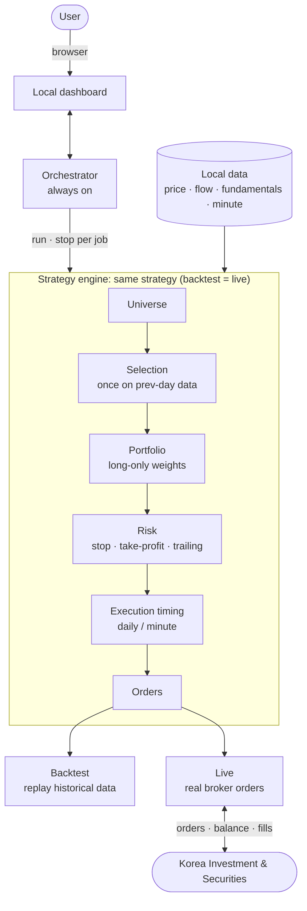

<div align="center">

# buylow


**A personal automated-trading toolkit with a Korean-equity dashboard and short-horizon US-equity strategies. Start with KIS paper trading and keep real-account settings separate.**

Korean equities use a [QuantConnect LEAN](https://github.com/QuantConnect/Lean) web dashboard. US equities use a Python terminal runner sharing strategy and order-state logic across CSV replay, KIS paper trading, and real trading. Sharing logic does not guarantee identical fills.

[한국어](./README.md) · **English** · [日本語](./README.ja.md)

[](https://github.com/JeongSeongMok/buylow/releases)
[](./LICENSE)
[](https://github.com/JeongSeongMok/buylow/stargazers)


<sub>US-equity paper trading · Korean-equity automated trading · KIS · Toss Securities · uv · LEAN</sub>

</div>

---

## Table of contents

1. [Overview](#overview)
2. [Getting started with US equities](#getting-started-with-us-equities)
3. [US strategies and operating rules](#us-strategies-and-operating-rules)
4. [Comparing strategies with historical data](#comparing-strategies-with-historical-data)
5. [Using a real US-equity account](#using-a-real-us-equity-account)
6. [Environment configuration](#environment-configuration)
7. [Troubleshooting](#troubleshooting)
8. [Korean-equity features](#features)
9. [Supported brokers](#supported-brokers)
10. [Korean-equity dashboard](#dashboard)
11. [Architecture and pipeline](#architecture-and-pipeline)
12. [Korean-equity setup](#setup)
13. [Disclaimer](#disclaimer)
14. [License](#license)

---

## Overview

| Workflow | Interface | Requirements |
|---|---|---|
| US-equity paper/real trading | Terminal commands below | uv, Python 3.11, KIS credentials and account for the selected environment |
| US CSV backtest | `replay` | uv, Python 3.11, historical minute CSV; no API credentials |
| Korean-equity strategy/backtest/trading | Web dashboard | uv and .NET/LEAN, or Docker; data and broker configuration |

For US equities, **no .NET, Docker, KRX login, or Toss credentials are required**. US strategies are not yet selectable or monitored in the dashboard. The overseas implementation covers US NASDAQ, NYSE, and AMEX, not other countries.

Settings and history are stored locally. Authentication, quote, and order requests send the required information to the selected broker. Do not share `.env.local`, tokens, or account-state files.

US strategy and paper/real execution code is implemented with offline tests. **Authenticated account, order, partial-fill, and cancellation checks remain incomplete.** No historical weekly return has been measured. Available real-trading commands do not imply validated real-account operation.

---

## Getting started with US equities

### 1. Open the project in Terminal

On macOS, press `Command + Space`, search for Terminal, and open it. In Finder, locate your existing `buylow` folder. Type `cd ` in Terminal, leave the trailing space, drag the folder into the window, and press Return.

Run every command below from that folder. Copy one command box, paste it, and press Return. A long command may wrap visually but remains one line. Wait for the prompt before the next command; `run` deliberately keeps running.

If you do not have the source, download your fork from GitHub. Its **Code** menu provides the clone address. Do not clone again over an existing project folder; the upstream repository is linked above.

### 2. Install uv and Python

Skip the installer if uv is already installed.

```bash
curl -LsSf https://astral.sh/uv/install.sh | sh
```

Open a new Terminal, return to the project folder, and check uv.

```bash
uv --version
```

```bash
uv python install 3.11
```

```bash
uv sync --locked
```

`pyproject.toml` lists dependencies and `uv.lock` fixes their versions. `uv run` selects the project environment; do not activate a separate venv or install packages with pip. `uvx` is for standalone tools, not this application.

### 3. Prepare KIS paper trading

Apply for paper trading and API access at [KIS Open API](https://apiportal.koreainvestment.com). The account registered for API use must match the paper account.

| Requirement | Purpose |
|---|---|
| Paper App Key | Identifies the paper API application; distinct from real credentials |
| Paper App Secret | Authenticates token requests; keep it private |
| Equity paper account number | Selects the account; enter eight digits, a hyphen, and two digits |
| US paper-trading access and USD buying power | Enables orders; the CLI budget does not create account funds |
| Current US market quotes | Stale quotes cannot be used for entries; check market-data access if delayed during the regular session |

KIS guidance distinguishes equity paper accounts starting with `5` from futures/options paper accounts starting with `6`. Confirm the actual equity paper account in the broker's paper-trading screen, not just the API application list. Do not enter a real account number instead.

The US runner checks fills through REST and **does not require an HTS ID**. The separate Korean-equity WebSocket adapter does.

### 4. Save credentials and account

```bash
uv run --locked python -m orchestrator.us setup --mode demo
```

Enter the App Key, App Secret, and account number when prompted. **Input is hidden, including pasted text.** Press Return after each value. If an existing value is indicated, Return keeps it; you can add only the missing account number.

The command preserves other settings and saves to `.env.local`. It makes no API calls or orders. Subsequent `--env-file .env.local` options explicitly load this file. For manual editing, see [Environment configuration](#environment-configuration).

### 5. Check settings and connectivity

This checks local settings without network access.

```bash
uv run --locked --env-file .env.local python -m orchestrator.us doctor --mode demo
```

Before starting the runner, optionally check authentication, holdings, today's orders, and an AAPL quote against the paper server. **No orders are submitted.**

```bash
uv run --locked --env-file .env.local python -m orchestrator.us doctor --mode demo --online
```

A stale quote may be normal outside market hours. If quotes remain delayed during the regular session, check market-data access first. Successful reads do not validate order submission, cancellation, or fills.

### 6. Select one paper strategy

```bash
uv run --locked python -m orchestrator.us strategies
```

For intraday momentum, use a **USD 10,000** strategy budget. Broker buying power still limits purchases.

```bash
uv run --locked --env-file .env.local python -m orchestrator.us run --mode demo --strategy momentum --budget 10000 --trial week1
```

For opening-range breakout, use this command **instead**, not concurrently.

```bash
uv run --locked --env-file .env.local python -m orchestrator.us run --mode demo --strategy opening-range --budget 10000 --trial week1
```

| Option | Meaning |
|---|---|
| `--mode demo` | Uses paper credentials and the paper server, not real money |
| `--strategy` | Selects `momentum` or `opening-range` |
| `--budget` | USD allocated to this strategy; not the whole account balance |
| `--trial week1` | Saved experiment name; matching settings resume the existing experiment |

`"phase": "closed"` means the runner is waiting outside the regular session. It also waits when no stock passes the entry rules; it does not force trades.

### 7. Inspect results, stop, and resume

Leave the runner open, press `Command + N` for another Terminal, and enter the project folder again. This reads saved state without making API calls.

```bash
uv run --locked python -m orchestrator.us status --mode demo --strategy momentum --trial week1
```

Use `--strategy opening-range` if that is the strategy you started.

| Field | Meaning |
|---|---|
| `estimated_profit_usd`, `estimated_return_pct` | Estimates using the last saved prices and configured fees, not broker-finalized profit |
| `max_drawdown_pct` | Largest observed decline from peak equity; unobserved price changes are not captured |
| `positions` | Holdings managed by this experiment |
| `pending_orders` | Orders awaiting fill or cancellation confirmation |
| `fills` | Confirmed fills, including partial fills; not a count of completed round trips |
| `halt` | Reason for halting new entries, if any |

`order_submitted` means accepted/submitted, while `fill` means a confirmed fill. Acceptance alone does not add a holding.

Press **Control + C** in the runner's Terminal to stop. **Stopping does not cancel broker orders or liquidate holdings.** Check the broker's paper-trading screen and cancel/sell there if you intend to end exposure. Keep the Mac powered, awake, online, and its lid open; sleeping or disconnected software cannot monitor exits.

Resume a normally stopped experiment with the exact same command. Account, strategy, budget, stocks, and fee settings must match. A mismatch between broker holdings and saved state blocks resumption.

Use a new name such as `--trial week2` for a new experiment, after checking and resolving old holdings and pending orders. A new strategy does not adopt the old strategy's positions. Do not delete state files to bypass an error.

---

## US strategies and operating rules

Both strategies are long-only US equities, with no shorting, borrowing, options, or Korean orders. They support observing a short experiment, not guaranteed maximum weekly returns or a historically optimized portfolio.

| Rule | `momentum` | `opening-range` |
|---|---|---|
| Entry | Break above the preceding five minute bars' high | First upward crossing 0.05% above the opening 15-minute high |
| Trend | Above session VWAP; EMA 8 > EMA 21 | Same |
| Relative volume | At least 1.25 times recent average | At least 1.5 times recent average |
| Daily entry attempts | Six total, two per symbol | Four total, one per symbol |
| Time-based exit trigger | 60 minutes | 90 minutes |

Both need at least 22 completed current-session bars, including 22 consecutive recent minutes. Opening-range trading does not start immediately after minute 15. Entry filters also require price at least USD 5, recent average minute turnover at least USD 250,000, and bid/ask spread at most 0.2%.

The default scan list is `AAPL, MSFT, NVDA, AMD, AMZN, META, GOOGL, TSLA`. These are candidates, not unconditional purchases or predicted weekly winners. To specify candidates:

```bash
uv run --locked --env-file .env.local python -m orchestrator.us run --mode demo --strategy momentum --budget 10000 --trial custom1 --stocks AAPL,NASD:NVDA,NYSE:IBM
```

Unprefixed symbols use NASDAQ. Specify the actual exchange using `NASD`, `NYSE`, or `AMEX`. More stocks require more API requests and longer scans.

| Control | Default |
|---|---|
| Concurrent holdings | Three, including pending buys |
| Per-position allocation | At most 25% of the budget at entry |
| Planned trade risk | Integer shares sized to 0.35% of the budget, including stop distance and estimated costs |
| Stop distance | Greater of 1.25 × ATR or 0.6% of price; reject entry if wider than 2% |
| Target | Estimated net reward twice the planned loss, allowing for round-trip costs |
| Loss halt | 2% daily or 5% trial loss triggers no new buys and exit attempts |
| Re-entry cooldown | At least ten minutes after exit |
| Session close | No new entries in the final 45 minutes; exit/cancel attempts in the final ten |
| Trial length | At most five trading sessions or seven calendar days from start |

These are **triggers for limit orders**, not guaranteed exit prices, times, or loss caps, and not broker-held protective stops. Gaps and unfilled orders can leave exposure. Daily loss halts reset next session; trial loss halts remain latched.

Defaults assume **25bps (0.25%) commission per side and 5bps (0.05%) slippage**. Slippage is adverse movement between the decision and fill price. These are not your contractual fees and do not reproduce all taxes or FX costs. Set `--commission-bps` to your actual per-side assumption, with a new trial name when changing it. Replace `25` below if appropriate.

```bash
uv run --locked --env-file .env.local python -m orchestrator.us run --mode demo --strategy momentum --budget 10000 --trial fees1 --commission-bps 25
```

Normal regular hours are 09:30–16:00 New York time, corresponding to 22:30–05:00 next day in Korea during US daylight saving time and 23:30–06:00 otherwise. Exchange calendars handle holidays, early closes, and DST. Pre/post-market trading is excluded.

All authentication, quote, account, and order requests share a **minimum one-second interval**. Entry scans occur once a minute; pending-order polling is at least five seconds apart. Sequential requests can make actual cycles longer. This is a conservative runner setting, not a statement covering every KIS quota. Requests from other applications using the same key are not coordinated.

Quotes older than two minutes are rejected for new orders. Orders remaining after 45 seconds trigger cancellation requests and await confirmation. Partial fills are accounted for. Ambiguous order outcomes are not blindly resent; execution stops for broker-side reconciliation. See [US trading implementation record](./docs/US_TRADING_REVIEW.md) for sources and scope.

---

## Comparing strategies with historical data

`replay` is a local CSV backtest, not the broker paper account used by `run --mode demo`. Stop a paper runner and check its remaining exposure before downloading. `run`, online `doctor`, and `download` cannot run concurrently in the same mode.

Request recent five-session minute history, without submitting orders:

```bash
uv run --locked --env-file .env.local python -m orchestrator.us download --mode demo --sessions 5 --output data/us/week1.csv
```

Check the actual returned date ranges printed for each stock. Requesting five sessions does not guarantee five complete sessions from the broker. Replay the same CSV and budget with each strategy; neither command needs API credentials or network access.

```bash
uv run --locked python -m orchestrator.us replay --file data/us/week1.csv --strategy momentum --budget 10000 --output runs/us-replay/momentum-week1.json
```

```bash
uv run --locked python -m orchestrator.us replay --file data/us/week1.csv --strategy opening-range --budget 10000 --output runs/us-replay/opening-range-week1.json
```

Results include estimated profit, equity history, and fills. `finished_flat: false` means positions or pending orders remain at the end; do not treat that as a fully closed trading result. Existing output files are not overwritten; choose another filename such as `week2`.

Replay checks limit eligibility on subsequent bars, caps fills at 1% of bar volume, and includes assumed costs. It does not reproduce real order queues, latency, or broker-paper matching. A profitable week alone cannot establish future profitability.

External CSV columns must be `symbol,exchange,time,open,high,low,close,volume`. `time` is the **completed bar's end time**, with timezone, such as `2026-09-21T09:31:00-04:00`; `exchange` is `NASD`, `NYSE`, or `AMEX`. Prices are USD and volume is shares.

---

## Using a real US-equity account

**`run --mode real` submits real orders.** First exercise buys, partial fills, cancellation, sells, and restart behavior in paper trading, not only connectivity. Prepare overseas-trading access and USD buying power. Project-level real-account execution validation remains incomplete.

Real credentials are stored separately without replacing paper credentials.

```bash
uv run --locked python -m orchestrator.us setup --mode real
```

Read-only account and quote check:

```bash
uv run --locked --env-file .env.local python -m orchestrator.us doctor --mode real --online
```

The following is a USD 1,000 real-budget example, not a recommended allocation. Choose your own budget and fees. Integer shares and risk sizing can prevent purchases with small budgets.

```bash
uv run --locked --env-file .env.local python -m orchestrator.us run --mode real --strategy momentum --budget 1000 --trial real1
```

```bash
uv run --locked python -m orchestrator.us status --mode real --strategy momentum --trial real1
```

There is no automatic KRW-to-USD conversion. The runner uses USD buying power and excludes pre-existing manual holdings or orders instead of adopting them. Avoid another trading system modifying the same account/symbols during a run. Control+C still does not cancel orders or close positions.

---

## Environment configuration

[.env.example](./.env.example) lists supported credentials and operational environment settings. Unused services can stay blank. US strategy, budget, stocks, trial, and fees use command options, not environment variables.

To manually use the full template instead of `setup`, copy it only if `.env.local` does not exist:

```bash
test -e .env.local || (umask 077 && cp -n .env.example .env.local)
```

```bash
chmod 600 .env.local
```

```bash
open -e .env.local
```

Keep the file in plain text. The last command opens macOS TextEdit.

| Variables | Required for |
|---|---|
| `BUYLOW_KIS_DEMO_APP_KEY`, `BUYLOW_KIS_DEMO_APP_SECRET`, `BUYLOW_KIS_DEMO_ACCOUNT_NO` | KIS paper account access |
| `BUYLOW_KIS_APP_KEY`, `BUYLOW_KIS_APP_SECRET`, `BUYLOW_KIS_ACCOUNT_NO` | KIS real account access |
| `BUYLOW_KIS_DEMO_HTS_ID`, `BUYLOW_KIS_HTS_ID` | Korean-equity WebSocket fills only, not the US runner |
| `BUYLOW_TOSS_CLIENT_ID`, `BUYLOW_TOSS_CLIENT_SECRET` | Toss Korean-equity adapter; register the calling IP in Toss API settings |
| `KRX_ID`, `KRX_PW` | Korean data requiring KRX login, not US equities |
| `BUYLOW_BROKER` | Korean dashboard: `kis_demo`, `kis`, or `toss`; independent of US `--mode` |
| Optional dashboard/live/path/tool/seed settings | Explained with defaults in `.env.example` |

Preserve `KEY=value` syntax; do not paste secrets into shell commands. Precedence is environment, `config.local.yaml`, defaults. Blank credential variables do not erase YAML values. Explicitly pass `--env-file .env.local`; the file is not loaded automatically. Variables already exported in the shell may take precedence over the env file.

The template's `BUYLOW_BROKER=kis_demo` overrides the dashboard's saved broker. Comment out or update that line before changing brokers. `BUYLOW_LIVE_ENABLED` is commented out; explicitly setting it to `false` also overrides the dashboard's ON setting.

Docker Compose does not automatically inject `.env.local` credentials into the container. Use dashboard settings with the current Docker configuration. Shell-script options likewise need to be set in the script's execution environment.

US state and tokens are separate under `state/us-trading/demo/` and `state/us-trading/real/`. Paper `momentum --trial week1` uses `state/us-trading/demo/momentum-week1.json`. These directories and `.env.local` are Git-ignored, not encrypted. Rotate exposed keys through the broker, then update them with `setup`.

Toss references are saved in the [local documentation index](./docs/toss/INDEX.md). KIS references are in the [official open-trading-api repository](https://github.com/koreainvestment/open-trading-api), including `llms.txt`, `examples_llm/overseas_stock/`, and Postman examples. US trading uses KIS instead of KRX data; Korean whole-market flow and fundamentals have not been replaced with Toss data.

---

## Troubleshooting

| Symptom | Action |
|---|---|
| `uv: command not found` | Install uv, reopen Terminal, and return to the project folder |
| Missing `pyproject.toml` | Change into the `buylow` folder |
| Missing `.env.local` | Run `setup --mode demo` first, without `--env-file` |
| Missing `account_no` | Run setup, retain existing keys with Return, and add the paper account number |
| Authentication/account rejected | Check environment-specific keys and account registration |
| KIS `90070000` | Check the paper account and application/HTS ID match; do not arbitrarily delete accounts |
| `closed` or no trades | Check session, holidays, 22-bar warmup, quote freshness, signal conditions, budget, and buying power |
| Another runner active | Locate the existing process; stop it with Control+C in its Terminal if intended |
| Saved settings differ | Resume with original settings, or resolve exposure before starting a new trial |
| Unknown order/cancel outcome | Check broker order numbers, filled shares, and outstanding orders; do not bypass with state deletion or blind restart |
| Output file exists | Preserve it and choose a new `--output` filename |

```bash
uv run --locked python -m orchestrator.us --help
```

---

## Features

The following features, dashboard, and setup sections describe the **Korean-equity LEAN workflow**, not the separate intraday US strategies and USD budget.

### Signals (alpha): 7 of them

Each signal judges, per ticker per trading day, whether conditions are **buy-favorable / sell-favorable / neutral**. Parameters are tuned on the Strategy tab.

| Signal | Type | Description | Key parameters |
|---|---|---|---|
| EMA | Trend | Buy-favorable when the short MA is above the long MA, sell-favorable when below | Short / long periods |
| MACD | Trend·Momentum | Buy-favorable when the MACD line is above the signal line | Fast / slow / signal |
| RSI | Overbought·Mean-reversion | Buy-favorable when oversold, sell-favorable when overbought | Period / oversold / overbought |
| Momentum | Trend | Buy-favorable when the last N-day return is positive | Lookback period |
| Bollinger Bands | Mean-reversion·Breakout | Mean-reversion on band touch; switches to trend-following on a strong breakout | Period / std multiplier / switch threshold (%) |
| Value | Fundamental | Buy-favorable when low PER·low PBR and ROE (= PBR/PER) is above a floor (avoids value traps) | PER·PBR caps / ROE / dividend floor |
| Flow (supply-demand) | Korea-specific | Buy-favorable when the recent N-day cumulative net buying by foreigners/institutions/individuals (selectable) is positive | Cumulative days / investor selection |

Value and flow signals require fundamental and flow data to be loaded (see *Data management* below).

### Buy rules

Signals are combined into a boolean rule. Conditions within a group must all hold (**AND**), and groups are OR'd together (**OR**), to trigger a buy. You also set a **signal-hold period** (how many extra days to hold after the buy signal disappears). Only one strategy is stored (single strategy).

You build the concrete rule on the **Strategy tab of the dashboard** (condition-group builder): see [Dashboard](#dashboard) below.

### Risk management

The strategy decides buys; sells are decided by signal changes and the risk rules below (leave a field blank to disable it).

- **Per-security stop-loss (%)**: sell when the price drops N% from the buy price
- **Per-security take-profit (%)**: sell when unrealized gain reaches N%
- **Trailing stop (%)**: sell when the price drops N% from the post-buy high
- **Long-only (no shorting)** and a **concurrent-holdings cap** (when exceeded, hold only the most liquid names) apply by default.

### Execution timing (two-layer design)

The strategy runs in two layers, and **the same code executes identically in backtest and live**.

- **① Selection**: picks buy/sell candidates **once a day, always from the previous day's close** (no intraday re-selection → prevents overtrading).
- **② Execution timing**: decides only *when* to fill those candidates. The chosen timing automatically determines the data resolution.

| Timing | Resolution | Behavior |
|---|---|---|
| Open | Daily | Fill at the **open** of the next trading day |
| Close | Daily | Fill at the **close** (MarketOnClose) of the next trading day |
| Time-of-day | Minute | Fill the full quantity at a specified time |
| TWAP | Minute | Split the regular session (390 min) into N slices and fill the quantity across them (reduces market impact) |
| Pullback | Minute | Enter on a dip from a reference price / exit on a rebound |

- **Risk is also evaluated once a day at the close** (same philosophy as selection). Per-minute stop-losses were dropped because intraday noise caused overtrading; the close handles the liquidation *decision*, while the timing above handles the *fill*.
- Tickers/days without minute data **fall back to the open automatically**.
- Due to a LEAN data-feed limit, minute backtests are accurate only up to a scale of **tickers × trading days ≲ 10,000** (blocked beforehand if exceeded). Daily and live are unaffected.

### Backtest

- Period selection (date picker + quick buttons for 1 week / 1 month / 3 months / 6 months / 1 year); initial capital fixed at ₩100M.
- Universe: search by name/code, bulk-add an index (KOSPI200·KOSDAQ150), all tickers, or your own index (groups).
- Background execution + progress/logs, run history retained (SQLite, per-row/bulk delete).
- Results = a Korean-language summary (total return, final equity, max drawdown, win rate, Sharpe, etc.) + a trade log (date, ticker, buy/sell, quantity, amount, reason). Large trade logs (tens of thousands of rows) are shown with pagination.

### Data management

All data is managed on the **Data tab of the dashboard**.

- One **Update data** click incrementally loads price (OHLCV), flow (net buying by investor type), and fundamentals (PER/PBR) for all tickers (5-year backfill when empty).
- **Auto-load scheduler** (on by default): incrementally loads daily bars on a fixed interval while the server runs. If you designate minute-bar targets, it loads those too.
- **Minute loading**: pick tickers/indexes and store minute bars (already-loaded days are skipped) via the active broker's API (KIS keeps minute bars for **about 1 year at most**; Toss uses getCandles).
- **Load status**: search by name/code, filter by index, view per-ticker detail (price·flow).
- **My index (custom ticker group)**: group tickers you want on the Groups tab, then use them across backtest / minute loading / load status with one click as `★name`, just like KOSPI200.

### Live trading (KIS · Toss)

- Turn on automated trading on the **Trade tab** and it places real orders using your saved strategy + target tickers (turn it off to stop). KIS and Toss share the same screen and the same strategy code.
- Buys follow the strategy and timing; exits follow signals/risk: the same code as backtest.
- **Account monitoring**: deposits, buying power, holdings, market status, and trade history refresh every 10 seconds. KIS uses execution inquiry; Toss uses cumulative fills per order.
- **Today's selection**: previews which tickers would be bought/sold based on the saved strategy, target tickers, and current holdings (reproduces the once-a-day previous-close selection exactly).
- Automated trading is **off** by default; once on, it places orders immediately per the saved strategy. For the full live procedure see [docs/LIVE_KIS.md](./docs/LIVE_KIS.md) (KIS) · [docs/LIVE_TOSS.md](./docs/LIVE_TOSS.md) (Toss).
- **Process control**: enabled trading resumes after server restart. Stopping during startup also terminates a late process. An unknown order outcome disables trading and automatic restart; verify broker order history before manually resuming.
- **Live requires building the broker adapter DLL once** (the Docker install bakes it into the image automatically; a native install makes it optional since it isn't needed for backtest). If you flip the toggle without building it, you'll see a *"live adapter is missing"* notice: run the adapter-build step in [Setup](#setup) above (`scripts/build-adapter.sh` builds both the KIS and Toss adapters).

---

## Supported brokers

| Broker and market | Paper | Real | Interface and status |
|---|---|---|---|
| KIS US equities | Implemented | Implemented | `orchestrator.us`; account order/cancel/fill validation incomplete |
| KIS Korean equities | Implemented | Implemented | LEAN dashboard; account validation and restart open-order synchronization still need work |
| Toss Korean equities | Not provided | Implemented | LEAN dashboard; real-account validation incomplete |

US equities use the terminal commands above. The following broker notes apply to the Korean dashboard.

- Pick a broker on the Settings tab and enter its keys; inquiry and live orders then run through that broker.
- KIS keeps **live and paper app keys/accounts fully separate**, so each is registered and managed independently (same logic, different environment).
- **Toss Securities** currently has a live adapter only. OAuth2 keys (Client ID/Secret) resolve the account automatically (no account number / HTS ID). The official API supports WebSocket streams; this adapter currently confirms fills by **polling orders**.
- Trading (balance·orders) and **minute-bar loading run through the chosen broker's API** (KIS = 120 bars/call, ~1y retention; Toss = getCandles, 200 bars/call). **Daily historical data comes from the auth-free pykrx** (broker-independent).

---

## Dashboard

This dashboard is for Korean equities. Inspect US runs with `orchestrator.us status`.

| Tab | Contents |
|---|---|
| **Strategy** (default) | Signal parameters, buy rules (condition groups), risk, execution timing |
| **Backtest** | Run after choosing period·universe; results·trade log |
| **Data** | Update data, load status·search·index filter, minute loading, auto-scheduler status |
| **Groups** | Create·edit·delete your indexes (custom ticker groups) |
| **Settings** | Broker selection, KRX·broker API key entry (stored locally) |
| **Jobs** | Background-job progress·logs·run history |
| **● Trade** | Live account monitoring + automated trading on/off + target tickers + today's selection |

See the actual screens for each tab in the **[dashboard screenshot gallery →](./SCREENSHOTS.md)** (captions in Korean: the UI is Korean).

---

## Architecture and pipeline

For Korean equities, an always-on **orchestrator** receives backtest/live requests and manages a **LEAN engine per job**. The diagram below describes this workflow.

US equities share signals, sizing, and exits in `orchestrator/us_strategy.py` and order-state management in `orchestrator/us_runner.py`. `brokers/kis_us.py` connects KIS paper/real APIs; `orchestrator/us_replay.py` connects CSV replay. US exchange schedules and USD calculations are separate from Korean-market settings.



**Core design**

- **Write a strategy once and it applies identically to backtest and live** (isomorphism).
- Selection (what to buy/sell that day) runs once a day on the previous day's data; execution follows the chosen timing: two separated layers.
- The strategy decides buys; signal changes and risk decide sells.
- All data, settings, and history are stored only on the user's PC.

---

## Setup

This section installs the **Korean-equity dashboard and LEAN**. US-only users can use the uv setup in [Getting started with US equities](#getting-started-with-us-equities).

### Install

There are two ways to install: **Docker** (simplest, any OS) or a **native install** (Linux · macOS).
Both give you backtest and live in one go. **Windows users should use Docker** (a native install means
matching the .NET/Python runtimes by hand per OS, which is fiddly).

<details open>
<summary><b>① Docker (recommended: any OS)</b></summary>

You only need [Docker](https://docs.docker.com/get-docker/) (.NET, Python, and LEAN are all baked into the image).

```bash
git clone https://github.com/JeongSeongMok/buylow.git
cd buylow

# Build + start in the background (the first build takes a few minutes to fetch the .NET SDK + NuGet)
docker compose up -d --build
# To use a different port:  BUYLOW_PORT=9000 docker compose up -d --build

# Logs / stop
docker compose logs -f
docker compose down
```

- Data, results, and settings live in host directories (`data/`, `runs/`, `state/`), so they **persist even if
  you delete the container**: settings (`config.local.yaml`), run history (`buylow.db`), and the KIS token live in `state/`.
- API keys are entered in the dashboard's **Settings** tab and stored in `state/config.local.yaml`.
- The dashboard is mapped only to the host's `127.0.0.1`, so it is **local-only** (no external network exposure).
- The broker adapter DLLs (KIS·Toss) for live trading are included in the image.

</details>

<details>
<summary><b>② Native install (Linux · macOS)</b></summary>

You need **.NET 10 SDK** (runs the engine), **Python 3.11** (runs strategies), **uv** (Python env), and **git**.

```bash
# 1) .NET 10 SDK (add the export to ~/.zshrc or ~/.bashrc to make it permanent)
curl -fsSL https://dot.net/v1/dotnet-install.sh | bash -s -- --channel 10.0 --install-dir "$HOME/.dotnet"
export DOTNET_ROOT="$HOME/.dotnet" && export PATH="$HOME/.dotnet:$PATH"

# 2) Install uv (git must be installed separately)
curl -LsSf https://astral.sh/uv/install.sh | sh

# 3) Code + dependencies
git clone https://github.com/JeongSeongMok/buylow.git
cd buylow
uv python install 3.11
uv sync --locked

# 4) Run the dashboard (default port 8420)
uv run --locked python -m orchestrator.api
# To use a different port: BUYLOW_DASHBOARD_PORT=9000 uv run --locked python -m orchestrator.api

# 5) (For live trading: skip if you only backtest) Build the broker adapters (KIS·Toss)
uv run --locked python -m orchestrator.lean --prepare    # check Python and build the launcher (no orders)
scripts/build-adapter.sh                                  # build KIS·Toss adapters + copy DLLs next to the launcher
                                                          #   (one only: scripts/build-adapter.sh toss)
```

</details>

After launching, open the dashboard in your browser (default `http://127.0.0.1:8420`, or the port you set above).

`pyproject.toml`, `.python-version`, and `uv.lock` define Python 3.11 and the Python dependencies.
The orchestrator and LEAN strategies share the uv project environment; manual activation is unnecessary.
Run tests with `uv run --locked pytest`; omit development dependencies with `uv sync --locked --no-dev`.
To load `.env.local`, explicitly pass `--env-file .env.local` to `uv run`.
Use `uvx` for isolated standalone tools and `uv run` for this project's application and tests.

### Key setup

See the [macOS setup guide (Korean)](./docs/MACOS_SETUP.md) for commands, credentials, allowed IP settings, and validation limits.

For Korean equities, enter keys on the **Settings tab** or use [Environment configuration](#environment-configuration). Environment values override the dashboard's saved values.

- **KRX ID·password**: for flow·fundamental data ([free signup](https://data.krx.co.kr)). Not needed if you use price only.
- **Broker keys**: on the Settings tab, choose the broker and enter its keys.

  - **KIS (live/paper)**: App Key·App Secret·account number·HTS ID (separate for live/paper; the HTS ID is needed for live fill notifications).
  - **Toss Securities**: just Client ID·Client Secret (account and fills are automatic; no HTS ID).

### Korean-equity usage sequence

1. Select the broker in **Settings** and enter its credentials. KIS paper and real are separate; Toss has no paper server.
2. Load Korean-market data in **Data**. Do not enter US tickers here.
3. Configure and save signals, conditions, risk, and timing in **Strategy**.
4. Choose Korean symbols and a period in **Backtest**, then inspect results and trades.
5. For native installs, prepare the launcher and adapters below. Docker includes them.

```bash
uv run --locked python -m orchestrator.lean --prepare
```

```bash
scripts/build-adapter.sh
```

6. In **Trade**, confirm broker, paper/real indicator, and symbols before enabling trading. `kis_demo` submits paper orders; `kis` and `toss` submit real orders. US `momentum` and `opening-range` are not dashboard strategies.
7. Turn trading OFF first, then check broker holdings and pending orders. Stopping the process does not cancel/liquidate. Leaving trading enabled when shutting down the server may resume it on the next server start.

Korean KIS restart open-order synchronization and account-level fill validation remain incomplete. See [KIS Korean-equity trading](./docs/LIVE_KIS.md) and [Toss Korean-equity trading](./docs/LIVE_TOSS.md).

---

## Disclaimer

This software is provided for educational purposes. Automated trading carries significant financial risk, and you bear sole responsibility for any use. The authors are not liable for any financial loss. When using it, you must comply with your broker's API terms and all applicable laws and regulations. Backtest results are estimates based on historical data and do not guarantee future returns. In particular, live automated trading sends real orders the instant you flip the toggle, so be sure to validate thoroughly on a paper account and start with a small amount.

---

## License

[MIT License](./LICENSE) © buylow contributors
