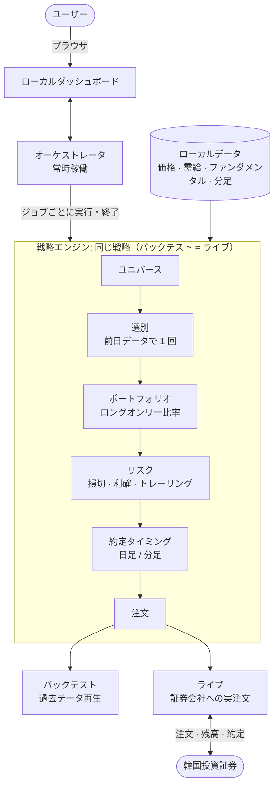

<div align="center">

# buylow


**韓国株ダッシュボードと米国株の短期戦略を備えた個人向け自動売買ツールキット。KIS の模擬投資から始め、実口座の設定を分けて運用できます。**

韓国株は [QuantConnect LEAN](https://github.com/QuantConnect/Lean)、米国株は Python 実行器を使い、両方とも Web 画面から開始できます。米国株では CSV 再生・KIS 模擬投資・実取引で戦略と注文状態管理を共有しますが、約定結果の一致は保証しません。

[한국어](./README.md) · [English](./README.en.md) · **日本語**

[](https://github.com/JeongSeongMok/buylow/releases)
[](./LICENSE)
[](https://github.com/JeongSeongMok/buylow/stargazers)


<sub>米国株模擬投資 · 韓国株自動売買 · KIS · トス証券 · uv · LEAN</sub>

</div>

---

## 目次

1. [概要](#概要)
2. [米国株を始める](#米国株を始める)
3. [米国株の戦略と運用ルール](#米国株の戦略と運用ルール)
4. [過去データで戦略を比較する](#過去データで戦略を比較する)
5. [米国株の実口座を使う](#米国株の実口座を使う)
6. [環境変数の設定](#環境変数の設定)
7. [困ったとき](#困ったとき)
8. [韓国株の機能](#機能)
9. [対応証券会社](#対応証券会社)
10. [韓国株ダッシュボード](#ダッシュボード)
11. [アーキテクチャとパイプライン](#アーキテクチャとパイプライン)
12. [韓国株セットアップ](#セットアップ)
13. [免責事項](#免責事項)
14. [ライセンス](#ライセンス)

---

## 概要

| 目的 | 操作方法 | 必要なもの |
|---|---|---|
| 米国株の模擬・実取引 | 米国株タブまたはターミナル | uv、Python 3.11、対象環境の KIS キーと口座 |
| 米国株 CSV バックテスト | `replay` | uv、Python 3.11、過去分足 CSV。API キー不要 |
| 韓国株の戦略・バックテスト・取引 | Web ダッシュボード | uv と .NET/LEAN または Docker、データと証券会社の設定 |

米国株だけなら **.NET、Docker、KRX ログイン、トスのキーは不要**です。最初に開く米国株タブで戦略選択・開始・停止・監視ができます。海外市場は米国 NASDAQ・NYSE・AMEX で、他国は含みません。

設定と履歴はローカル保存です。認証・時価取得・注文に必要な情報は証券会社 API に送信します。`.env.local`、トークン、口座状態ファイルを共有しないでください。

米国株戦略と模擬・実取引コードは実装済みで、オフラインテストがあります。ただし **実口座での認証・注文・部分約定・取消の確認は未完了**です。実データの週間収益率も未測定です。実取引コマンドの提供は、実口座検証済みという意味ではありません。

---

## 米国株を始める

### キー保存済みなら Web 画面を開く

```bash
uv run --locked --env-file .env.local python -m orchestrator.api
```

**http://127.0.0.1:8420/us** を開きます。ルートアドレスも米国株に接続します。更新前のサーバーが動いていれば Control+C で停止し、上のコマンドで再起動してください。

1. 模擬投資と、モメンタム（最大保有 60 分）または開始範囲ブレイク（90 分）を選びます。韓国戦略の 3 日設定とは別です。
2. 自動探索または手動指定を選び、USD 予算・実験名・手数料を設定します。自動では手動銘柄欄を使いません。保存だけでは注文しません。
3. 開始すると状態・保有・未約定・最近の約定・推定損益を 5 秒ごとに表示します。
4. 米国株停止ボタンで実行を止め、証券会社の注文・保有を別途確認します。停止は取消・全売却ではありません。

実取引は実注文への明示的な同意が必要です。ブラウザを閉じても継続し、サーバー終了で停止します。再起動後は自動再開しません。別途 CLI で開始した実行はそのターミナルで停止してください。同じモードで Web と CLI を同時実行しないでください。初回導入や CLI 利用は以下を参照します。

### 1. ターミナルでプロジェクトを開く

macOS で `Command + Space` を押し、ターミナルを検索して開きます。Finder で既存の `buylow` フォルダを見つけてください。ターミナルに `cd ` と入力し、末尾の空白を残してフォルダをドラッグし、Return を押します。

以降はすべてこのフォルダで実行します。各コード枠の一行をコピーして貼り付け、Return を押してください。画面上で折り返されても一行のコマンドです。入力待ちに戻ったら次へ進みます。自動売買の `run` は動き続けるのが正常です。

ソースがなければ GitHub のフォークを取得してください。**Code** メニューからクローン URL をコピーできます。既存フォルダがあれば再クローンは不要です。原本の GitHub リンクは文書上部にあります。

### 2. uv と Python を準備する

uv が導入済みならインストールは省略します。

```bash
curl -LsSf https://astral.sh/uv/install.sh | sh
```

新しいターミナルを開き、プロジェクトフォルダに戻って実行します。

```bash
uv --version
```

```bash
uv python install 3.11
```

```bash
uv sync --locked
```

`pyproject.toml` は依存パッケージ、`uv.lock` は固定バージョンを定義します。`uv run` が環境を選ぶので、別の venv 有効化や pip インストールは不要です。`uvx` は単独ツール用で、このアプリの実行には使いません。

### 3. KIS 模擬投資を準備する

[KIS Open API](https://apiportal.koreainvestment.com) で模擬投資と API 利用を申し込みます。API に登録した口座と模擬口座を一致させてください。

| 必要なもの | 用途 |
|---|---|
| 模擬 App Key | 模擬 API の利用者を識別。実取引用とは別です |
| 模擬 App Secret | トークン発行の認証。共有しないでください |
| 株式模擬口座番号 | 照会・注文先。8 桁、ハイフン、2 桁で入力します |
| 米国株模擬取引の利用状態と USD 買付可能額 | 注文に必要です。コマンドの予算は口座資金を作りません |
| 米国株のリアルタイム時価 | 古い気配では新規注文しません。通常立会中も遅延するなら時価利用権限を確認します |

KIS の案内では株式模擬口座は `5`、先物・オプション模擬口座は `6` で始まります。API 申込一覧だけでなく、証券会社の模擬投資画面で実際の株式口座を確認してください。実口座番号を代用しないでください。

この米国株実行器は REST で約定を確認するため **HTS ID は不要**です。韓国株の WebSocket 約定通知には必要です。

### 4. キーと口座を保存する

```bash
uv run --locked python -m orchestrator.us setup --mode demo
```

App Key、App Secret、口座番号を順に入力します。**貼り付けても文字が表示されないのが正常です。** 各項目で Return を押します。既存値があると表示されたら、空入力の Return で維持できます。キーが保存済みなら口座番号だけ追加できます。

他の設定を保持して `.env.local` に保存し、API 呼び出しや注文は行いません。後の `--env-file .env.local` はこのファイルを読み込む指定です。手動編集は [環境変数の設定](#環境変数の設定) を参照してください。

### 5. 設定と接続を確認する

ネットワークを使わず必須設定だけ確認します。

```bash
uv run --locked --env-file .env.local python -m orchestrator.us doctor --mode demo
```

実行前に模擬サーバーの認証・保有・当日注文・AAPL 気配を照会する場合はこちらです。**注文は出しません。**

```bash
uv run --locked --env-file .env.local python -m orchestrator.us doctor --mode demo --online
```

閉場中に時価が古いのは正常な場合があります。通常立会中も遅延する場合は時価利用状態を確認してください。照会の成功だけでは注文・取消・約定を検証できません。

### 6. 戦略を一つ選んで模擬投資を開始する

```bash
uv run --locked python -m orchestrator.us strategies
```

短期モメンタムを選ぶ例です。予算は **10,000 米ドル**で、口座の買付可能額も上限になります。

```bash
uv run --locked --env-file .env.local python -m orchestrator.us run --mode demo --strategy momentum --budget 10000 --trial week1
```

開始後の価格帯ブレイクを選ぶ場合は、上の代わりに次を使います。**同時に実行しないでください。**

```bash
uv run --locked --env-file .env.local python -m orchestrator.us run --mode demo --strategy opening-range --budget 10000 --trial week1
```

| オプション | 意味 |
|---|---|
| `--mode demo` | 模擬キーと模擬サーバーを使用。実資金の注文ではありません |
| `--strategy` | `momentum` または `opening-range` |
| `--budget` | 戦略に割り当てる USD 予算。口座全体の残高とは別です |
| `--trial week1` | 保存する実験名。同じ設定なら継続します |

`"phase": "closed"` は通常立会外の待機状態です。開場しても条件に合う銘柄がなければ注文しません。取引回数を強制的に埋める戦略ではありません。

### 7. 結果、停止、再開

実行中のターミナルを残し、`Command + N` で別ウィンドウを開いてプロジェクトに移動します。以下は保存状態を読むだけで API を呼びません。

```bash
uv run --locked python -m orchestrator.us status --mode demo --strategy momentum --trial week1
```

`opening-range` を動かした場合は `--strategy` も同じ値にします。

| 表示項目 | 意味 |
|---|---|
| `estimated_profit_usd`, `estimated_return_pct` | 保存した最終時価と設定手数料による推定損益。証券会社の確定値ではありません |
| `max_drawdown_pct` | 観測した評価資産の高値からの最大下落率。観測間の変動は含みません |
| `positions` | この実験が管理する保有 |
| `pending_orders` | 約定・取消確認待ちの注文 |
| `fills` | 部分約定を含む確認済み約定。往復取引回数ではありません |
| `halt` | 新規取引を止めた理由。空なら停止理由なし |

`order_submitted` は注文受付、`fill` は約定確認です。受付だけで保有に加えません。

停止は実行中のターミナルで **Control + C**。**停止しても証券会社の未約定や保有は残ります。** 投資も終了するなら証券会社の模擬画面で確認して取消・売却してください。Mac の電源・通信を維持し、蓋を閉じずスリープさせないでください。停止・通信断の間は損切りを監視できません。

通常停止した実験は同じコマンドで再開します。口座・戦略・予算・銘柄・手数料設定が一致する必要があり、保存状態と口座保有が違えば再開を拒否します。

新実験には `--trial week2` など別名を使います。先に旧実験の未約定・保有を確認・整理してください。新戦略は旧戦略の保有を自動継承しません。エラー回避のために状態ファイルを消さないでください。

---

## 米国株の戦略と運用ルール

### 自動銘柄探索と更新

Web で自動探索を選ぶと、KIS の NASDAQ・NYSE・AMEX の価格急騰と出来高急増ランキングから
候補を更新します。各 API の最初のページが対象で、全米銘柄の網羅的な探索ではありません。
手動から切り替えるときは既存の保有・未約定を確認し、新しい実験名を使います。

通常立会の開始 22 分後から 5 分間隔で更新を試み、最大 12 銘柄を選びます。両ランキングに
登場し、株価 5 ドル以上、当日上昇率 3%以上、15 分上昇率が正、累積出来高 10 万株以上、
推定累積売買代金 500 万ドル以上、最近 15 分の平均売買代金が分当たり 25 万ドル以上、
気配差 0.2%以下を要求します。売買代金は価格と出来高による近似です。名前に ETF・ETN・
2X・3X・ワラント・権利の表示がある商品を除外しますが、銘柄マスター分類の代替ではありません。

通過した銘柄のパーセンタイル順位を当日上昇率 40%、15 分上昇率 35%、最近の売買代金 25%で
合成し、気配コストを差し引きます。既存候補には維持加点 3 点を与えて入れ替えを抑えます。
候補に入るだけでは買わず、確定分足・トレンド・相対出来高の戦略条件も必要です。
この重みは初期運用規則で、収益性を最適化・実証した数値ではありません。

ランキングから外れても保有・未約定は管理を続けます。探索失敗や 10 分超のスナップショットは
新規買いを止めますが保有管理は止めません。再起動後も再取得が必要です。約定・手仕舞いの後に
順位 API を一つずつ照会し、分足も銘柄を順番に確認するため、応答が遅ければ一巡に 1 分以上
かかります。画面に候補の因子・点数・更新時刻・エラーを表示し、履歴は状態ファイルの隣の
`*.universe.jsonl` に保存します。

```bash
uv run --locked --env-file .env.local python -m orchestrator.us run --mode demo --strategy momentum --budget 10000 --trial auto1 --universe-mode auto
```

自動モードでは `--stocks` を使いません。CLI で `--universe-mode` を省略すると手動です。
CSV 再生は固定銘柄方式です。現在の急騰銘柄を過去価格に当てても自動探索の過去検証にはならず、
当時の候補選定記録と価格データの両方が必要です。

### 候補内での売買ルール

両戦略は米国株の買いと売却のみで、空売り・借入・オプション・韓国株注文は使いません。一週間の短期実験用であり、週間最高収益や過去最適化を保証しません。

| 条件 | `momentum` | `opening-range` |
|---|---|---|
| 参入 | 直前 5 本の分足高値を突破 | 開始 15 分の高値を 0.05% 上回る最初の上抜け |
| トレンド | 当日 VWAP より上、EMA 8 > EMA 21 | 同じ |
| 出来高 | 最近の平均の 1.25 倍以上 | 最近の平均の 1.5 倍以上 |
| 一日の新規参入試行 | 全体 6 回、銘柄ごと 2 回 | 全体 4 回、銘柄ごと 1 回 |
| 保有時間による売却判断 | 60 分 | 90 分 |

当日の確定分足が最低 22 本必要で、最近の 22 分が連続している必要があります。開始 15 分直後から売買するわけではありません。株価 5 ドル以上、最近の分当たり平均売買代金 25 万ドル以上、気配スプレッド 0.2% 以下も必要です。

手動モードの標準監視対象は `AAPL, MSFT, NVDA, AMD, AMZN, META, GOOGL, TSLA`。条件に合う銘柄を探す候補であり、全部買う指定や週間勝者の予測ではありません。変更例：

```bash
uv run --locked --env-file .env.local python -m orchestrator.us run --mode demo --strategy momentum --budget 10000 --trial custom1 --stocks AAPL,NASD:NVDA,NYSE:IBM
```

接頭辞なしは NASDAQ と解釈します。実際の取引所に合わせて `NASD`・`NYSE`・`AMEX` を指定してください。銘柄を増やすとリクエストと探索時間も増えます。

| 管理項目 | 標準設定 |
|---|---|
| 同時保有 | 未約定買いを含め最大 3 銘柄 |
| 銘柄別配分 | 参入時に予算の最大 25% |
| 一取引の計画損失 | 損切り幅と推定費用を含め予算の 0.35% 以内となる整数株数 |
| 損切り距離 | ATR の 1.25 倍と株価の 0.6% の大きい方。2% より広ければ参入しない |
| 目標価格 | 往復費用を考慮し、推定純利益が計画損失の 2 倍となる価格 |
| 損失による停止 | 日次 2% または実験全体 5% の評価損失で新規買い停止・売却試行 |
| 再参入待ち | 売却後最低 10 分 |
| 引け対応 | 45 分前に新規参入停止、10 分前に売却・未約定買い取消を試行 |
| 期間 | 最大 5 取引セッション、または開始後 7 日 |

これらは **指値注文を出す条件**で、価格・時間・損失上限を保証するものではありません。証券会社に常駐する保護注文でもありません。価格急変や未約定で保有が残ることがあります。日次損失停止は次セッションに解除し、実験全体の停止は維持します。

費用の標準仮定は **片道手数料 25bps（0.25%）、スリッページ 5bps（0.05%）**。スリッページは判断時から約定までの不利な価格差です。実際の契約手数料ではなく、税金・為替費用をすべて再現もしません。`--commission-bps` で自分の片道手数料仮定を指定し、変更時は新しい実験名にします。必要なら下の `25` を変更してください。

```bash
uv run --locked --env-file .env.local python -m orchestrator.us run --mode demo --strategy momentum --budget 10000 --trial fees1 --commission-bps 25
```

通常立会は原則ニューヨーク時間 09:30〜16:00。韓国時間では米国夏時間中が 22:30〜翌 05:00、それ以外は 23:30〜翌 06:00 です。取引所カレンダーで休場・短縮立会・夏時間を処理し、時間外取引は行いません。

認証・気配・口座・注文の全リクエストに **最低 1 秒間隔**を適用します。参入探索は毎分、未約定照会は最低 5 秒間隔ですが、順次処理のため実際には長くなる場合があります。これは実行器の保守的な設定で、KIS の全制限を保証するものではありません。同じキーを使う他プログラムの呼び出しは合算管理しません。

2 分超の古い時価で新規注文しません。45 秒以上残る注文には取消を要求し、確認を待ちます。部分約定を反映し、受付結果不明の注文を無条件に再送しません。不明な場合は停止して証券会社の注文履歴を確認します。調査元と実装範囲は [米国株実装記録](./docs/US_TRADING_REVIEW.md) を参照してください。

---

## 過去データで戦略を比較する

`replay` はローカル CSV バックテストで、模擬サーバーに注文する `run --mode demo` とは別です。実行中の模擬投資を止めて残る注文・保有を確認してからダウンロードしてください。同じモードで `run`・オンライン `doctor`・`download` は同時実行できません。

直近 5 セッションを要求する例です。注文は行いません。

```bash
uv run --locked --env-file .env.local python -m orchestrator.us download --mode demo --sessions 5 --output data/us/week1.csv
```

銘柄ごとに表示される実際の取得期間を確認してください。5 セッションを指定しても全期間の取得を保証しません。同じ CSV と予算で比較します。以下は API キー・ネットワーク不要です。

```bash
uv run --locked python -m orchestrator.us replay --file data/us/week1.csv --strategy momentum --budget 10000 --output runs/us-replay/momentum-week1.json
```

```bash
uv run --locked python -m orchestrator.us replay --file data/us/week1.csv --strategy opening-range --budget 10000 --output runs/us-replay/opening-range-week1.json
```

結果には推定損益・評価資産推移・約定履歴が入ります。`finished_flat` が `false` ならデータ終了時に保有または未約定が残るため、決済済み成績として比較しないでください。既存ファイルは上書きせず、次回は `week2` など別名を指定します。

再生では注文後の分足で指値到達を判定し、一足の出来高の最大 1% まで約定させて費用を反映します。実際の待ち行列・遅延・模擬サーバーの約定は再現しません。一週間の利益だけで将来の収益性は判断できません。

外部 CSV の列は `symbol,exchange,time,open,high,low,close,volume`。`time` は **確定分足の終了時刻**で、`2026-09-21T09:31:00-04:00` のようにタイムゾーンが必要です。取引所は `NASD`・`NYSE`・`AMEX`、価格は USD、出来高は株数です。

---

## 米国株の実口座を使う

**`run --mode real` は実口座に実注文を送ります。** 模擬で照会だけでなく買い・部分約定・取消・売却・再開を確認し、海外株取引と USD 買付可能額を準備してください。プロジェクトの実口座実行検証は未完了です。

実取引キーは模擬キーを置き換えず別項目に保存します。

```bash
uv run --locked python -m orchestrator.us setup --mode real
```

注文しない口座・気配照会：

```bash
uv run --locked --env-file .env.local python -m orchestrator.us doctor --mode real --online
```

次は 1,000 ドルの実予算を指定する書式例で、推奨配分ではありません。予算・手数料は自分の口座に合わせてください。少額では整数株とリスク計算により買えない場合があります。

```bash
uv run --locked --env-file .env.local python -m orchestrator.us run --mode real --strategy momentum --budget 1000 --trial real1
```

```bash
uv run --locked python -m orchestrator.us status --mode real --strategy momentum --trial real1
```

ウォンからドルへの自動両替はありません。USD 買付可能額を使い、既存の手動保有・未約定は引き継がず対象から外します。同じ口座・銘柄を別の売買システムで同時操作しないでください。実取引でも Control+C は取消・全売却ではありません。

---

## 環境変数の設定

[.env.example](./.env.example) に認証・運用設定をまとめています。使わないサービスのキーは不要です。米国株の戦略・予算・銘柄・実験名・手数料はコマンドオプションで指定します。

`setup` の代わりに全項目を手動編集する場合、既存ファイルがないときだけコピーします。

```bash
test -e .env.local || (umask 077 && cp -n .env.example .env.local)
```

```bash
chmod 600 .env.local
```

```bash
open -e .env.local
```

最後のコマンドで macOS のテキストエディットが開きます。標準テキスト形式を維持してください。

| 変数 | 用途 |
|---|---|
| `BUYLOW_KIS_DEMO_APP_KEY`, `BUYLOW_KIS_DEMO_APP_SECRET`, `BUYLOW_KIS_DEMO_ACCOUNT_NO` | KIS 模擬口座 |
| `BUYLOW_KIS_APP_KEY`, `BUYLOW_KIS_APP_SECRET`, `BUYLOW_KIS_ACCOUNT_NO` | KIS 実口座 |
| `BUYLOW_KIS_DEMO_HTS_ID`, `BUYLOW_KIS_HTS_ID` | 韓国株 WebSocket 約定通知。米国株は不要 |
| `BUYLOW_TOSS_CLIENT_ID`, `BUYLOW_TOSS_CLIENT_SECRET` | トス韓国株アダプタ。API 設定で呼び出し IP の許可が必要 |
| `KRX_ID`, `KRX_PW` | ログインが必要な韓国データ。米国株は不要 |
| `BUYLOW_BROKER` | 韓国ダッシュボードの `kis_demo`・`kis`・`toss`。米国の `--mode` とは別 |
| 画面・自動売買・パス・ツール・シードの任意設定 | `.env.example` のコメントに用途と既定値 |

`KEY=値` を維持し、キーをコマンドに直接書かないでください。優先順位は環境変数、`config.local.yaml`、既定値です。空の認証項目は YAML の値を削除しません。`.env.local` は自動読込されないので `--env-file .env.local` を指定します。シェルで既に設定した環境変数がファイルより優先する場合もあります。

テンプレートの `BUYLOW_BROKER=kis_demo` はダッシュボードの保存値より優先します。画面から証券会社を変えるならこの行をコメント化または更新してください。`BUYLOW_LIVE_ENABLED` は標準でコメント状態です。明示的な `false` は画面の ON も上書きします。

Docker Compose は `.env.local` のキーをコンテナへ自動転送しません。現在の Docker 構成では画面の設定タブで保存してください。シェルスクリプト用オプションも、その実行環境に設定する必要があります。

米国株の状態とトークンは `state/us-trading/demo/` と `state/us-trading/real/` に分離します。模擬 `momentum --trial week1` は `state/us-trading/demo/momentum-week1.json` を使います。これらと `.env.local` は Git 対象外ですが暗号化保存ではありません。漏洩したキーは証券会社で再発行して `setup` で更新してください。

トス資料は [ローカル文書目次](./docs/toss/INDEX.md)、KIS 資料は [公式 open-trading-api](https://github.com/koreainvestment/open-trading-api) の `llms.txt`・`examples_llm/overseas_stock/`・Postman 例を参照します。米国株は KRX ではなく KIS API を使いますが、韓国市場全体の需給・ファンダメンタルをトスで置き換えたわけではありません。

---

## 困ったとき

時価・口座照会の一時的な通信失敗、HTTP 429・サーバーエラーでは終了せず、5 秒から最大
60 秒の間隔で再試行します。認証通信失敗は最低 65 秒待ちます。待機中は新規注文を判断せず、
保有・注文状態を維持します。失敗した API と次回時刻を画面と `*.errors.jsonl` に記録します。
口座・キーの不備や注文受付結果不明は自動再送しません。通信障害中の損切り約定は保証できません。

| 状況 | 対処 |
|---|---|
| `uv: command not found` | uv 導入後にターミナルを開き直し、プロジェクトに移動 |
| `pyproject.toml` がない | `buylow` フォルダで実行しているか確認 |
| `.env.local` がない | `--env-file` を付けずに `setup --mode demo` を先に実行 |
| `account_no` が不足 | setup でキーを Return で維持し、模擬口座番号を追加 |
| 認証・口座照会拒否 | 模擬・実取引のキーと口座、API 登録を確認 |
| KIS `90070000` | 模擬口座と申込 ID・HTS ID の一致を確認。口座をむやみに削除しない |
| `closed`・取引なし | 立会・休場、22 分の準備、時価遅延、条件、予算、買付可能額を確認 |
| 別の実行器が動作中 | 既存ターミナルを確認。停止するならそこで Control+C |
| 保存設定と不一致 | 元の設定で継続するか、残る保有を確認して新実験名で開始 |
| 注文・取消結果が不明 | 証券会社の注文番号・約定・未約定を確認。状態削除や無条件の再実行で回避しない |
| 出力ファイルがある | 既存記録を残し、別の `--output` 名を指定 |

```bash
uv run --locked python -m orchestrator.us --help
```

---

## 機能

以下の機能・画面・セットアップは **韓国株 LEAN 経路**の説明です。米国株のザラ場戦略・USD 予算とは別です。

### シグナル（アルファ）: 7 種

各シグナルは取引日ごとに銘柄単位で、**買い優勢 / 売り優勢 / 中立**を判定します。パラメータは戦略設定タブで調整します。

| シグナル | 種別 | 説明 | 主なパラメータ |
|---|---|---|---|
| EMA | トレンド | 短期移動平均が長期移動平均より上なら買い優勢、下なら売り優勢 | 短期・長期の期間 |
| MACD | トレンド・モメンタム | MACD ラインがシグナルラインより上なら買い優勢 | 短期・長期・シグナル |
| RSI | 過熱・逆張り | 売られすぎなら買い優勢、買われすぎなら売り優勢 | 期間・売られすぎ・買われすぎ |
| モメンタム | トレンド | 直近 N 日のリターンがプラスなら買い優勢 | 観測期間 |
| ボリンジャーバンド | 平均回帰・ブレイクアウト | バンドタッチ時は平均回帰、強くブレイクすればトレンド追随へ切替 | 期間・標準偏差倍率・切替しきい値（%） |
| 割安（バリュー） | ファンダメンタル | 低 PER・低 PBR かつ ROE（= PBR/PER）が基準以上なら買い優勢（バリュートラップ回避） | PER・PBR 上限・ROE・配当下限 |
| 需給追随 | 韓国市場特化 | 外国人・機関・個人（選択）の直近 N 日累積純買いがプラスなら買い優勢 | 累積日数・投資主体の選択 |

バリュー・需給シグナルは、ファンダメンタル・需給データが読み込まれていないと動作しません（下記 *データ管理* 参照）。

### 買いルール

シグナルをブール論理ルールで組み合わせます。1 つのグループ内の条件はすべて満たし（**AND**）、グループ同士はいずれか 1 つを満たせば（**OR**）買います。また**シグナル保有期間**（買いシグナルが消えた後に何日追加で保有するか）も指定します。戦略は 1 つだけ保存されます（単一戦略）。

具体的なルールの構成は、**ダッシュボードの戦略設定タブ**（条件グループビルダー）で行います: 下記 [ダッシュボード](#ダッシュボード) 参照。

### リスク管理

買いは戦略が、売りはシグナルの変化と下記のリスクが決定します（項目を空にすると無効）。

- **銘柄ストップロス（%）**: 買値より N% 下落したら売り
- **銘柄テイクプロフィット（%）**: 評価益が N% に達したら売り
- **トレーリングストップ（%）**: 買い後の高値から N% 下落したら売り
- **ロングオンリー（空売り禁止）**および**同時保有銘柄上限**（超過時は流動性上位のみ保有）がデフォルトで適用されます。

### 約定タイミング（2 層構造）

戦略は 2 層で動作し、**同じコードがバックテストとライブで同一に**実行されます。

- **① 選別**: **常に前日の終値データで 1 日 1 回**、買い/売り対象を選びます（ザラ場中の再選別なし → 過剰取引を防止）。
- **② 約定タイミング**: その対象を*いつ*約定するかだけを選びます。選んだタイミングがデータ解像度を自動的に決定します。

| タイミング | 解像度 | 動作 |
|---|---|---|
| 始値 | 日足 | 翌取引日の**始値**で約定 |
| 終値 | 日足 | 翌取引日の**終値**（MarketOnClose）で約定 |
| 指定時刻 | 分足 | 指定した時刻に全量約定 |
| TWAP | 分足 | 通常立会（390 分）を N 等分して数量を分割約定（マーケットインパクト緩和） |
| 押し目 | 分足 | 基準値より押したら参入 / 反発したら手仕舞い |

- **リスク評価も終値基準で 1 日 1 回**です（選別と同じ思想）。分足での毎分ストップロスはザラ場ノイズで過剰取引を招くため廃止し、手仕舞いの「判断」は終値で、「約定」は上記タイミングが処理します。
- 分足がない銘柄/日付は**始値へ自動フォールバック**します。
- 分足バックテストは LEAN のデータフィードの制約により、**銘柄数 × 取引日 ≲ 10,000** 規模までしか正確ではありません（超過時は事前にブロック）。日足・ライブは無関係です。

### バックテスト

- 期間選択（日付ピッカー + 1 週・1 か月・3 か月・6 か月・1 年のクイックボタン）、初期資金 1 億ウォン固定。
- ユニバース：銘柄名・コード検索、インデックス一括追加（KOSPI200・KOSDAQ150）、全銘柄、マイインデックス（グループ）。
- バックグラウンド実行 + 進捗・ログ、実行履歴の保管（SQLite、行単位/全体の削除）。
- 結果 = 韓国語サマリー（総リターン・最終資産・最大ドローダウン・勝率・シャープなど）+ 取引履歴（日付・銘柄・買い/売り・数量・金額・理由）。大量（数万件）の取引もページネーションで表示。

### データ管理

データはすべて**ダッシュボードのデータタブ**で管理します。

- **データ更新**を 1 回押すだけで、全銘柄の価格（OHLCV）・需給（投資主体別純買い）・ファンダメンタル（PER/PBR）を増分読み込み（空なら直近 5 年をバックフィル）。
- **自動読み込みスケジューラ**（デフォルト ON）: サーバー稼働中に一定周期で日足を増分読み込み。分足の対象銘柄を指定すれば併せて取得します。
- **分足読み込み**: 銘柄/インデックスを選んで分足を保存（取得済みの日はスキップ）。アクティブな証券会社の API で取得します（KIS は分足を**最大で約 1 年**保持、トスは getCandles）。
- **読み込み状況**: 銘柄名・コード検索、インデックスフィルタ、銘柄詳細（価格・需給）の照会。
- **マイインデックス（カスタム銘柄グループ）**: グループタブで好きな銘柄をまとめておくと、バックテスト・分足読み込み・読み込み状況で KOSPI200 のように `★名前` でまとめて使えます。

### ライブ取引（KIS · トス）

- **取引タブ**で自動売買を ON にすると、保存した戦略 + 対象銘柄で実際の注文を出します（OFF で停止）。KIS もトスも同じ画面・同じ戦略コードです。
- 買いは戦略・タイミング通りに、手仕舞いはシグナル/リスク通りに: バックテストと同じコード。
- **口座モニタリング**: 預り金・買付可能額・保有銘柄・市場状態・取引履歴を 10 秒ごとに更新します。KIS は約定照会、トスは注文ごとの累計約定を使用します。
- **本日の選定**: 保存戦略・対象銘柄・現在の保有に基づき、組み入れる/外す銘柄を事前表示します（前日終値 1 回の選別をそのまま再現）。
- 自動売買はデフォルトで **OFF** で、ON にすると保存した戦略通りに即座に注文を出します。詳しいライブ手順は [docs/LIVE_KIS.md](./docs/LIVE_KIS.md)（KIS）· [docs/LIVE_TOSS.md](./docs/LIVE_TOSS.md)（トス）を参照。
- **実行制御**: 有効な自動売買はサーバー再起動後に再開します。起動中の停止要求も遅れて生成されたプロセスを終了させます。注文の受付結果が不明な場合は自動売買と自動再起動を停止し、証券会社の注文履歴を確認した後に手動で再開します。
- **ライブには証券会社アダプタ DLL のビルドが一度必要です**（Docker インストールはイメージに同梱され自動。直接インストールはバックテストには不要なため任意）。ビルドせずにトグルを ON にすると *「ライブアダプタ（...）がありません」* という案内が出ます: 上記 [セットアップ](#セットアップ) のアダプタビルド手順を実行してください（`scripts/build-adapter.sh` が KIS・トス両方のアダプタをビルド）。

---

## 対応証券会社

| 証券会社・市場 | 模擬 | 実取引 | 経路・状態 |
|---|---|---|---|
| KIS 米国株 | 実装 | 実装 | `orchestrator.us`。口座での注文・取消・約定検証は未完了 |
| KIS 韓国株 | 実装 | 実装 | LEAN 画面。口座検証と再開時の未約定同期の補完が必要 |
| トス韓国株 | 提供なし | 実装 | LEAN 画面。実口座検証は未完了 |

米国株は米国株タブまたは上のターミナルを使います。以下の証券会社説明は韓国株画面についてです。

- 設定タブで証券会社を選びキーを入力すると、照会・実注文がその証券会社で動作します。
- KIS は**実取引と模擬投資のアプリキー・口座が完全に分離**されており、それぞれ個別に登録・管理します（同じロジック、環境のみ異なる）。
- **トス証券**は現在、実取引用アダプタのみを提供しています。OAuth2 キー（Client ID/Secret）で口座を自動取得します（口座番号・HTS ID 不要）。公式 API は WebSocket にも対応していますが、このアダプタは**注文ポーリング**で約定を確認します。
- 売買（残高・注文）・**分足の読み込みは選んだ証券会社の API** で動作します（KIS=120 件/呼び出し・約 1 年保持、トス=getCandles 200 件/呼び出し）。**日足の過去データは認証不要の pykrx**で取得します（証券会社の選択とは無関係）。

---

## ダッシュボード

米国株タブで二つの設定済み戦略を運用・監視できます。`orchestrator.us status` も使えます。以下の他のタブは韓国株用です。

| タブ | 内容 |
|---|---|
| **戦略設定**（デフォルト） | シグナルのパラメータ、買いルール（条件グループ）、リスク、約定タイミング |
| **バックテスト** | 期間・ユニバースを選んで実行、結果・取引履歴 |
| **データ** | データ更新、読み込み状況・検索・インデックスフィルタ、分足読み込み、自動スケジューラの状態 |
| **グループ** | マイインデックス（カスタム銘柄グループ）の作成・編集・削除 |
| **設定** | 証券会社の選択、KRX・証券会社 API キーの入力（ローカル保存） |
| **実行中** | バックグラウンドジョブの進捗・ログ・実行履歴 |
| **● 取引** | ライブ口座モニタリング + 自動売買 on/off + 対象銘柄 + 本日の選定 |

各タブの実際の画面は **[ダッシュボードのスクリーンショット集 →](./SCREENSHOTS.md)** で確認できます（キャプションは韓国語: UI が韓国語のため）。

---

## アーキテクチャとパイプライン

韓国株では常時稼働の **オーケストレータ**がリクエストを受け、**ジョブごとに LEAN エンジンを実行**します。下図はこの韓国株経路です。

米国株は `orchestrator/us_strategy.py` のシグナル・数量・手仕舞いと `orchestrator/us_runner.py` の注文状態管理を共有します。`brokers/kis_us.py` が KIS 模擬・実取引、`orchestrator/us_replay.py` が CSV 再生を接続します。米国カレンダーと USD 計算は韓国市場設定から分離しています。



**コア設計**

- **戦略を一度書けば、バックテストとライブに同一に適用**されます（同型性）。
- 選別（その日に組み入れる/外す銘柄）は前日データで 1 日 1 回、約定は選んだタイミング通りに: 2 層に分離されています。
- 買いは戦略が、売りはシグナルの変化とリスクが決定します。
- すべてのデータ・設定・履歴はユーザーの PC にのみ保存されます。

---

## セットアップ

この節は **韓国株画面と LEAN** の導入です。米国株だけなら [米国株を始める](#米国株を始める) の uv 設定で十分です。

### インストール

インストール方法は 2 通りです: **Docker**（最も簡単・全 OS）または**直接インストール**（Linux · macOS）。
どちらもバックテストとライブを一度に揃えます。**Windows ユーザーは Docker を推奨**します（直接インストールは
.NET/Python ランタイムを OS ごとに手で合わせる必要があり煩雑です）。

<details open>
<summary><b>① Docker（推奨: 全 OS）</b></summary>

[Docker](https://docs.docker.com/get-docker/) さえあれば動きます（.NET・Python・LEAN はすべてイメージに同梱）。

```bash
git clone https://github.com/JeongSeongMok/buylow.git
cd buylow

# ビルド + バックグラウンド起動（初回ビルドは .NET SDK・NuGet の取得で数分かかります）
docker compose up -d --build
# 別のポートで開くには:  BUYLOW_PORT=9000 docker compose up -d --build

# ログ表示 / 停止
docker compose logs -f
docker compose down
```

- データ・結果・設定はホストのディレクトリ（`data/`・`runs/`・`state/`）に保存されるため、コンテナを
  削除しても**保持**されます: 設定（`config.local.yaml`）・実行履歴（`buylow.db`）・KIS トークンは `state/` にまとまります。
- API キーはダッシュボードの**設定**タブで入力し、`state/config.local.yaml` に保存されます。
- ダッシュボードはホストの `127.0.0.1` にのみマッピングされるため**ローカル専用**です（外部ネットワークへの公開なし）。
- ライブ用の証券会社アダプタ DLL（KIS・トス）はイメージに含まれています。

</details>

<details>
<summary><b>② 直接インストール（Linux · macOS）</b></summary>

**.NET 10 SDK**（エンジンの実行）・**Python 3.11**（戦略の実行）・**uv**（Python 環境）・**git** が必要です。

```bash
# 1) .NET 10 SDK（恒久化するには ~/.zshrc または ~/.bashrc に export を追記）
curl -fsSL https://dot.net/v1/dotnet-install.sh | bash -s -- --channel 10.0 --install-dir "$HOME/.dotnet"
export DOTNET_ROOT="$HOME/.dotnet" && export PATH="$HOME/.dotnet:$PATH"

# 2) uv のインストール（git は別途必要）
curl -LsSf https://astral.sh/uv/install.sh | sh

# 3) コード + 依存関係
git clone https://github.com/JeongSeongMok/buylow.git
cd buylow
uv python install 3.11
uv sync --locked

# 4) ダッシュボードの起動（デフォルトポート 8420）
uv run --locked python -m orchestrator.api
# 別のポートで開くには: BUYLOW_DASHBOARD_PORT=9000 uv run --locked python -m orchestrator.api

# 5) （ライブ実取引用: バックテストのみなら省略可）証券会社アダプタのビルド（KIS・トス）
uv run --locked python -m orchestrator.lean --prepare    # Python 確認 + ランチャービルド（注文なし）
scripts/build-adapter.sh                                  # KIS・トスのアダプタをビルド + DLL をランチャーの隣にコピー
                                                          #   （片方だけ: scripts/build-adapter.sh toss）
```

</details>

起動するとブラウザでダッシュボード（デフォルト `http://127.0.0.1:8420`、上で変更したポートがあればそのポート）にアクセスします。

Python 3.11 と依存関係は `pyproject.toml`・`.python-version`・`uv.lock` で管理します。
オーケストレータと LEAN 戦略は同じ uv 環境を使うため、手動での有効化は不要です。
テストは `uv run --locked pytest`、開発依存を除くインストールは `uv sync --locked --no-dev` です。
`.env.local` を使う場合は `uv run` に `--env-file .env.local` を明示してください。
`uvx` は独立したツール用です。このプロジェクトの実行とテストには `uv run` を使います。

### キー設定

コマンド、認証情報、許可 IP と検証範囲は [macOS 設定ガイド（韓国語）](./docs/MACOS_SETUP.md)を参照してください。

韓国株のキーは **設定タブ**または [環境変数の設定](#環境変数の設定) で保存します。同じ環境変数があれば画面の保存値より優先します。

- **KRX の ID・パスワード**: 需給・ファンダメンタルデータ用（[無料登録](https://data.krx.co.kr)）。価格のみ使う場合は不要。
- **証券会社のキー**: 設定タブで証券会社を選び、キーを入力します。

  - **KIS（実取引/模擬）**: App Key・App Secret・口座番号・HTS ID（実取引/模擬は各々分離、HTS ID はライブの約定通知に必要）。
  - **トス証券**: Client ID・Client Secret のみ（口座・約定は自動、HTS ID 不要）。

### 韓国株の利用手順

1. **設定**で証券会社とキーを登録します。KIS 模擬・実取引は別設定で、トスに模擬サーバーはありません。
2. **データ**で韓国市場を読み込みます。米国ティッカーを入れないでください。
3. **戦略設定**で指標・条件・リスク・タイミングを保存します。
4. **バックテスト**で韓国銘柄と期間を選び、成績と履歴を確認します。
5. 直接導入なら以下でランチャーとアダプタを準備します。Docker には含まれます。

```bash
uv run --locked python -m orchestrator.lean --prepare
```

```bash
scripts/build-adapter.sh
```

6. **取引**で証券会社・模擬/実取引表示・銘柄を確認して ON にします。`kis_demo` は模擬、`kis`・`toss` は実注文です。米国の `momentum`・`opening-range` はこの画面から実行できません。
7. 停止時は先に自動売買を OFF にし、証券会社の未約定・保有を確認します。プロセス停止だけでは取消・全売却されません。ON のままサーバーを止めると次回起動時に再開する場合があります。

韓国 KIS の再開時未約定同期と口座での約定検証は未完了です。[KIS 韓国株取引](./docs/LIVE_KIS.md)・[トス韓国株取引](./docs/LIVE_TOSS.md) も参照してください。

---

## 免責事項

本ソフトウェアは教育目的で提供されます。自動売買には相当の金融リスクが伴い、使用に伴う責任はすべて利用者にあります。制作者はいかなる金銭的損失についても責任を負いません。使用にあたっては証券会社の API 規約および関連法規を必ず遵守してください。バックテストの結果は過去データに基づく推定であり、将来の収益を保証しません。特にライブ自動売買はトグルを ON にした瞬間に実際の注文が送信されるため、必ず模擬投資で十分に検証したうえで少額から始めてください。

---

## ライセンス

[MIT License](./LICENSE) © buylow contributors
