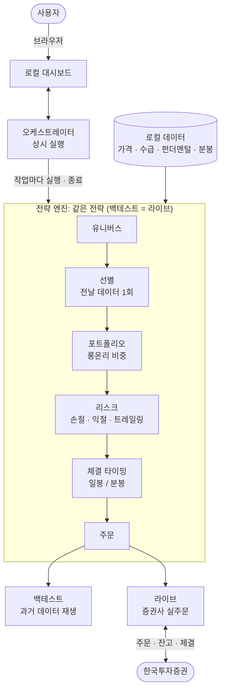

<div align="center">

# buylow


**국내주식 대시보드와 미국주식 단기 전략을 함께 제공하는 개인용 자동매매 툴킷. 한국투자증권 모의투자로 시작하고, 설정을 분리해 실전 계좌를 사용할 수 있습니다.**

국내주식은 [QuantConnect LEAN](https://github.com/QuantConnect/Lean) 기반 웹 대시보드, 미국주식은 Python 터미널 실행기를 사용합니다. 미국주식 실행기는 과거 CSV 재생과 한투 모의·실전에 같은 전략·주문 상태 관리 로직을 사용합니다. 실제 체결 결과까지 같다는 뜻은 아닙니다.

**한국어** · [English](./README.en.md) · [日本語](./README.ja.md)

[](https://github.com/JeongSeongMok/buylow/releases)
[](./LICENSE)
[](https://github.com/JeongSeongMok/buylow/stargazers)


<sub>미국주식 모의투자 · 국내주식 자동매매 · 한국투자증권(KIS) · 토스증권 · uv · LEAN</sub>

</div>

---

## 목차

1. [개요](#개요)
2. [미국주식 처음 시작하기](#미국주식-처음-시작하기)
3. [미국주식 전략과 운영 규칙](#미국주식-전략과-운영-규칙)
4. [미국주식 과거 데이터로 비교하기](#미국주식-과거-데이터로-비교하기)
5. [미국주식 실전 계좌 사용하기](#미국주식-실전-계좌-사용하기)
6. [환경변수 전체 설정](#환경변수-전체-설정)
7. [문제가 생겼을 때](#문제가-생겼을-때)
8. [국내주식 기능](#기능)
9. [지원 증권사](#지원-증권사)
10. [국내주식 대시보드](#대시보드)
11. [아키텍처 및 파이프라인](#아키텍처-및-파이프라인)
12. [국내주식 셋업](#셋업)
13. [면책 조항](#면책-조항)
14. [라이선스](#라이선스)

---

## 개요

| 이용하려는 기능 | 사용 방법 | 필요한 것 |
|---|---|---|
| 미국주식 단기 모의·실전 | 아래 터미널 명령 | uv, Python 3.11, 한투 해당 환경의 키·계좌 |
| 미국주식 CSV 백테스트 | `replay` 명령 | uv, Python 3.11, 과거 분봉 CSV. API 키 불필요 |
| 국내주식 전략 구성·백테스트·매매 | 웹 대시보드 | uv와 .NET/LEAN 또는 Docker, 필요한 데이터·증권사 설정 |

미국주식만 이용한다면 아래 미국주식 안내를 따라가시면 됩니다. **.NET, Docker, KRX 로그인, 토스 키가 필요하지 않습니다.** 미국주식 전략은 현재 대시보드에서 선택하거나 감시하는 기능이 없으며, 터미널에서 실행하고 확인합니다. 지원 해외시장은 미국 NASDAQ·NYSE·AMEX이며 다른 나라 시장은 포함하지 않습니다.

설정과 실행 이력은 로컬에 저장됩니다. 인증·시세 조회·주문에 필요한 정보는 선택한 증권사 API로 전송됩니다. `.env.local`, 토큰, 계좌 상태 파일을 공유하지 마세요.

현재 미국주식 전략과 모의·실전 연결 코드는 구현되어 있고 오프라인 테스트가 있습니다. **실제 계좌에서 인증·주문·부분체결·취소까지 확인한 상태는 아닙니다.** 실데이터로 측정한 주간 수익률도 아직 없습니다. 아래 실전 명령이 있다는 것과 실거래 검증이 끝났다는 것은 다릅니다.

---

## 미국주식 처음 시작하기

### 1. 터미널에서 프로젝트 폴더 열기

macOS에서 `Command + Space`를 누르고 `터미널`을 검색해 실행하세요. Finder에서 이미 내려받은 `buylow` 폴더를 찾으세요. 터미널에 `cd `를 입력한 뒤, **뒤의 공백을 남겨 둔 상태로** 그 폴더를 터미널 창에 끌어 놓고 `Return`을 누르면 해당 폴더로 이동합니다.

이후 명령은 모두 이 폴더에서 실행합니다. 명령 상자 안의 한 줄을 복사해 터미널에 붙여 넣고 `Return`을 누르세요. 긴 명령이 화면에서 접혀 보여도 한 줄입니다. 명령이 끝나 입력 커서가 다시 나타나면 다음 명령을 실행합니다. 자동매매 `run` 명령은 계속 실행되는 것이 정상입니다.

아직 소스가 없다면 GitHub에서 사용할 포크를 내려받으세요. 포크의 주소는 GitHub 저장소의 **Code** 메뉴에서 복사할 수 있습니다. 기존 폴더가 있다면 다시 복제하지 않습니다. 원본 주소는 이 문서 상단의 GitHub 링크입니다.

### 2. uv와 Python 설치

uv가 이미 설치되어 있다면 설치 명령은 건너뛰세요.

```bash
curl -LsSf https://astral.sh/uv/install.sh | sh
```

설치 후 터미널을 새로 열고, 앞의 방법으로 다시 `buylow` 폴더에 들어오세요.

```bash
uv --version
```

Python 3.11을 준비합니다.

```bash
uv python install 3.11
```

프로젝트에 고정된 버전의 패키지를 설치합니다.

```bash
uv sync --locked
```

`pyproject.toml`은 필요한 패키지 목록, `uv.lock`은 함께 사용할 정확한 버전 목록입니다. `uv run`이 프로젝트 환경을 선택하므로 `venv` 활성화나 `pip install`은 하지 않습니다. `uvx`는 별도 도구를 격리 실행할 때 쓰는 명령이며, buylow 자체는 `uv run`으로 실행합니다.

### 3. 한투 모의투자 준비

[한국투자증권 Open API](https://apiportal.koreainvestment.com)에서 모의투자 서비스와 API 사용을 신청하고 다음을 준비하세요. 모의투자 계좌와 API 신청에 연결한 계좌가 일치해야 합니다.

| 필요한 항목 | 무엇이며 왜 필요한가 |
|---|---|
| 모의 App Key | 모의투자 API 사용자를 식별하는 키입니다. 실전용과 별개입니다. |
| 모의 App Secret | 인증 토큰 발급에 사용하는 비밀키입니다. 다른 사람에게 보내지 마세요. |
| 주식 모의계좌번호 | 조회·주문할 모의계좌입니다. `8자리-2자리` 형식으로 입력합니다. |
| 미국주식 모의거래 가능 상태·USD 매수가능금액 | 주문 가능한 시장과 가상 달러 잔액이 필요합니다. 명령의 예산은 계좌에 돈을 만들어 주지 않습니다. |
| 미국주식 실시간 시세 이용 가능 상태 | 실행기는 오래된 호가로 주문하지 않습니다. 정규장에도 지연 시세라면 한투에서 시세 권한을 확인해야 합니다. |

한투 안내상 주식 모의계좌는 `5`, 선물·옵션 모의계좌는 `6`으로 시작합니다. API 신청 화면의 계좌 목록만 보지 말고, 한투 모의투자 화면에서 실제 주식 모의계좌를 확인하세요. 실전 계좌번호를 대신 넣으면 안 됩니다.

이 미국주식 실행기는 REST로 체결을 조회하므로 **HTS ID를 입력받지 않습니다.** 기존 국내주식 자동매매의 웹소켓 체결통보에는 HTS ID가 필요합니다.

### 4. 키와 계좌번호 저장

```bash
uv run --locked python -m orchestrator.us setup --mode demo
```

App Key, App Secret, 계좌번호를 차례로 물어봅니다. **입력하거나 붙여 넣어도 화면에 글자가 표시되지 않는 것이 정상입니다.** 각 값을 넣고 `Return`을 누르세요. `[기존 값 있음]`이 표시되면 그냥 `Return`을 눌러 저장된 값을 유지할 수 있습니다. 키가 이미 있다면 계좌번호만 추가하면 됩니다.

프로젝트의 `.env.local`에 저장하며 기존 다른 설정을 보존합니다. 이 명령은 API 호출이나 주문을 하지 않습니다. 이후 명령의 `--env-file .env.local`은 이 파일을 읽으라는 뜻입니다. 전체 항목을 직접 편집하려면 [환경변수 전체 설정](#환경변수-전체-설정)을 참고하세요.

### 5. 설정과 연결 확인

아래 명령은 인터넷 연결 없이 필수 설정 유무만 확인합니다.

```bash
uv run --locked --env-file .env.local python -m orchestrator.us doctor --mode demo
```

실제 한투 모의 서버의 인증·잔고·당일 주문·AAPL 호가 조회를 확인하려면 다음 명령을 사용합니다. **이 명령도 주문은 내지 않습니다.** 자동매매를 시작하기 전에 실행하세요.

```bash
uv run --locked --env-file .env.local python -m orchestrator.us doctor --mode demo --online
```

장이 닫혔을 때 호가가 오래되었다고 나오는 것은 정상일 수 있습니다. 미국 정규장에도 계속 지연된다면 거래를 시작하기 전에 시세 이용 상태를 확인하세요. 조회 성공만으로 주문·취소·체결까지 확인된 것은 아닙니다.

### 6. 전략을 하나 골라 모의투자 시작

선택 가능한 전략을 봅니다.

```bash
uv run --locked python -m orchestrator.us strategies
```

장중 짧은 상승 돌파를 찾는 `momentum`을 선택하는 예입니다. 예산은 **10,000달러**이며 계좌의 실제 모의 매수가능금액보다 많이 주문할 수 없습니다.

```bash
uv run --locked --env-file .env.local python -m orchestrator.us run --mode demo --strategy momentum --budget 10000 --trial week1
```

개장 초 가격대 돌파를 보는 `opening-range`를 선택하려면 위 명령 대신 아래 명령을 사용하세요. **두 명령을 동시에 실행하지 마세요.**

```bash
uv run --locked --env-file .env.local python -m orchestrator.us run --mode demo --strategy opening-range --budget 10000 --trial week1
```

| 옵션 | 뜻 |
|---|---|
| `--mode demo` | 한투 모의 서버와 모의 키를 사용합니다. 실제 돈으로 주문하지 않습니다. |
| `--strategy momentum` | 사용할 전략입니다. `opening-range`로 바꿀 수 있습니다. |
| `--budget 10000` | 이번 전략의 USD 기준 운용 예산입니다. 전체 계좌 잔액과는 별개입니다. |
| `--trial week1` | 실행 기록의 이름입니다. 같은 조건·이름으로 실행하면 이어서 진행합니다. |

정규장 전후에는 `"phase": "closed"` 상태로 기다립니다. 정규장이 열려도 조건에 맞는 종목이 없으면 주문하지 않습니다. 강제로 거래 횟수를 채우는 전략은 아닙니다.

### 7. 결과 확인, 중지, 재개

자동매매 터미널을 그대로 두고 `Command + N`으로 새 터미널을 여세요. 다시 `buylow` 폴더로 이동한 뒤 다음을 실행하면 저장된 결과를 볼 수 있습니다. API를 추가 호출하지 않습니다.

```bash
uv run --locked python -m orchestrator.us status --mode demo --strategy momentum --trial week1
```

`opening-range`를 실행했다면 위 명령의 `momentum`도 `opening-range`로 바꾸세요.

| 표시 항목 | 읽는 방법 |
|---|---|
| `estimated_profit_usd` / `estimated_return_pct` | 마지막 저장 시세와 설정 수수료 기준의 추정 손익·수익률입니다. 증권사 확정 손익이 아닙니다. |
| `max_drawdown_pct` | 실행기가 관측한 평가자산 고점 대비 최대 하락률입니다. 관측 사이 변동은 포함하지 못합니다. |
| `positions` | 이 전략이 관리하는 보유 주식입니다. |
| `pending_orders` | 접수 또는 취소 확인을 기다리는 주문입니다. |
| `fills` | 확인된 체결 기록입니다. 부분체결도 기록되므로 왕복 거래 횟수와 다릅니다. |
| `halt` | 신규 거래를 멈춘 사유입니다. 비어 있으면 중단 사유가 없는 상태입니다. |

실행 로그의 `order_submitted`는 **주문 접수**, `fill`은 **체결 확인**입니다. 접수만으로 주식을 샀다고 처리하지 않습니다.

멈추려면 실행 중인 터미널에서 **Control + C**를 누르세요. **프로그램 종료는 미체결 취소나 보유 주식 전량 매도를 뜻하지 않습니다.** 한투 모의투자 화면에서 미체결·보유 수량을 확인하고, 거래도 끝내려면 그 화면에서 취소·매도해야 합니다. Mac 절전, 덮개 닫기, 네트워크 단절 중에는 프로그램이 손절을 감시할 수 없습니다. 실행 중에는 전원·네트워크를 유지하고 절전되지 않도록 하세요.

정상 중지한 실험을 이어가려면 시작할 때 쓴 명령을 그대로 실행하세요. 기존 계좌·전략·예산·종목·수수료 설정이 같아야 합니다. 계좌와 저장 상태가 다르면 재개를 거부합니다.

새 실험은 `--trial week2`처럼 새 이름을 사용합니다. 이전 실험의 미체결과 보유를 확인·정리한 뒤 시작하세요. 이전 전략이 산 주식을 새 전략이 자동 인수하지 않습니다. 문제를 없애려고 상태 파일을 지우지 마세요.

---

## 미국주식 전략과 운영 규칙

두 전략은 미국주식 매수 후 매도만 수행합니다. 공매도·레버리지 차입·옵션·국내주식 주문은 사용하지 않습니다. 일주일 안에 결과를 관찰할 수 있는 단기 실험용이며, 최대 수익률을 보장하거나 과거 수익률 순으로 최적화한 전략은 아닙니다.

| 항목 | `momentum` | `opening-range` |
|---|---|---|
| 진입 조건 | 직전 5개 분봉 고점 돌파 | 개장 첫 15분 고점을 0.05% 넘는 첫 상향 돌파 |
| 추세 조건 | 당일 거래량 가중 평균가(VWAP) 위, EMA 8 > EMA 21 | 동일 |
| 거래량 조건 | 최근 평균 대비 1.25배 이상 | 최근 평균 대비 1.5배 이상 |
| 하루 신규 진입 시도 상한 | 전체 6회, 종목당 2회 | 전체 4회, 종목당 1회 |
| 보유시간에 따른 매도 판단 | 60분 | 90분 |

공통으로 당일의 완성된 분봉이 최소 22개 필요하며 최근 22분이 연속이어야 합니다. `opening-range`도 15분 만에 바로 거래하지 않고 지표 준비를 기다립니다. 주가 5달러 이상, 최근 분당 평균 거래대금 25만 달러 이상, 매수·매도 호가 차이 0.2% 이하인 경우만 진입을 검토합니다.

기본 감시 종목은 `AAPL, MSFT, NVDA, AMD, AMZN, META, GOOGL, TSLA`입니다. 전부 매수하는 포트폴리오가 아니라, 조건을 만족하는 종목을 고르는 **후보 목록**입니다. 특정 주의 최고 수익 종목이라는 뜻은 아닙니다. 후보를 직접 바꾸는 예는 다음과 같습니다.

```bash
uv run --locked --env-file .env.local python -m orchestrator.us run --mode demo --strategy momentum --budget 10000 --trial custom1 --stocks AAPL,NASD:NVDA,NYSE:IBM
```

접두사 없는 티커는 NASDAQ으로 해석합니다. 거래소는 `NASD`, `NYSE`, `AMEX` 중 실제 상장 거래소를 지정하세요. 종목 목록이 길어질수록 API 요청량과 한 번의 탐색 시간이 늘어납니다.

### 예산과 매도 규칙

| 항목 | 기본 동작 |
|---|---|
| 동시 보유 | 최대 3종목. 미체결 매수도 자리를 차지합니다. |
| 종목별 투자 비중 | 진입 시 예산의 최대 25% |
| 한 거래의 계획 손실 | 손절 거리와 예상 비용을 합쳐 예산의 0.35% 이내로 정수 주 수량 계산 |
| 손절 가격 거리 | 최근 변동폭 지표 ATR의 1.25배와 주가의 0.6% 중 큰 값. 2%보다 넓으면 진입하지 않음 |
| 목표 가격 | 예상 왕복 비용을 반영한 순수익이 계획 손실의 2배가 되도록 계산 |
| 손실에 따른 중단 | 일일 평가손실 2% 또는 실험 전체 평가손실 5% 도달 시 신규 매수 중단·청산 시도 |
| 재진입 대기 | 같은 종목은 청산 후 최소 10분 대기 |
| 장 마감 대응 | 마감 45분 전 신규 진입 중단, 10분 전 보유 청산·미체결 매수 취소 시도 |
| 실험 기간 | 최대 5거래세션 또는 시작 후 7일. 기간 종료 후 신규 진입 없이 종료 처리 |

손절·익절·보유시간·손실 한도는 **매도 주문을 내는 조건**입니다. 증권사에 미리 걸어두는 보장형 손절 주문이 아닙니다. 모의·실전 모두 지정가 주문이므로 가격 급변이나 미체결 시 그 가격·시간·손실률에 청산된다고 보장하지 못합니다. 일일 손실 중단은 다음 거래세션에 해제되지만, 실험 전체 손실 중단은 유지합니다.

기본 비용은 **편도 수수료 25bps(0.25%)와 슬리피지 5bps(0.05%) 가정**입니다. 슬리피지는 주문 판단 가격과 실제 체결 가격 사이의 불리한 차이를 뜻합니다. 이 수치는 사용자의 실제 약정 수수료가 아니며 세금·환전비용을 모두 재현하지도 않습니다. 실제 약정에 맞춰 `--commission-bps`를 지정할 수 있습니다. 아래 `25`를 본인 편도 수수료로 바꾸세요. 수수료 변경도 새 실험 이름을 사용합니다.

```bash
uv run --locked --env-file .env.local python -m orchestrator.us run --mode demo --strategy momentum --budget 10000 --trial fees1 --commission-bps 25
```

### 시간대와 API 호출 속도

미국 정규장은 통상 뉴욕 시간 09:30~16:00입니다. 한국에서는 서머타임 적용 시 22:30~다음 날 05:00, 미적용 시 23:30~다음 날 06:00에 해당합니다. 실행기는 거래소 달력으로 휴장·조기 폐장·서머타임을 처리하며 프리마켓·애프터마켓은 거래하지 않습니다.

인증·시세·잔고·주문 요청 전체에 **최소 1초 간격**을 두고, 신규 종목 탐색은 분당 한 번, 미체결 조회는 최소 5초 간격으로 수행합니다. 계좌·종목별 요청이 차례로 처리되므로 실제 주기는 더 길어질 수 있습니다. 이는 이 실행기의 보수적인 설정이지 한투 공식 한도를 모두 대체하는 보장은 아닙니다. 같은 키로 다른 프로그램을 돌리는 요청까지 합산 제어하지는 않습니다.

2분보다 오래된 시세로 신규 주문하지 않습니다. 45초 이상 남은 주문은 취소를 요청하고 취소 확인을 기다립니다. 부분체결 수량을 반영하며, 접수 결과가 불명확한 주문을 그대로 재전송하지 않습니다. 확인이 안 되면 실행을 멈추므로 증권사 주문내역을 먼저 확인해야 합니다.

전략 조사 출처와 구현 범위는 [미국주식 구현 기록](./docs/US_TRADING_REVIEW.md)에 있습니다.

---

## 미국주식 과거 데이터로 비교하기

`replay`는 CSV 가격을 과거 순서대로 읽는 **로컬 백테스트**입니다. 한투 모의 서버에 주문하는 `run --mode demo`와 다릅니다. 먼저 실행 중인 모의투자를 중지하고 미체결·보유 상태를 확인한 뒤 데이터를 내려받으세요. 같은 모드에서 `download`, 온라인 `doctor`, `run`을 동시에 실행할 수 없습니다.

최근 5거래세션을 요청하는 예입니다. 주문하지 않으며, 한투가 반환한 실제 날짜 범위를 종목별로 출력합니다. 요청했다고 반드시 5일치 전체를 받을 수 있는 것은 아닙니다.

```bash
uv run --locked --env-file .env.local python -m orchestrator.us download --mode demo --sessions 5 --output data/us/week1.csv
```

같은 CSV와 예산으로 두 전략을 각각 재생합니다. API 키나 인터넷 연결 없이 실행됩니다.

```bash
uv run --locked python -m orchestrator.us replay --file data/us/week1.csv --strategy momentum --budget 10000 --output runs/us-replay/momentum-week1.json
```

```bash
uv run --locked python -m orchestrator.us replay --file data/us/week1.csv --strategy opening-range --budget 10000 --output runs/us-replay/opening-range-week1.json
```

결과 파일에는 추정 손익, 평가자산 변화, 체결 기록이 저장됩니다. `finished_flat`이 `false`라면 데이터 종료 시 보유 또는 미체결이 남은 상태이므로 완료된 매매 성과처럼 비교하지 마세요. 같은 파일명이 이미 있으면 덮어쓰지 않습니다. 다음 실행에서는 `week2`처럼 다른 파일명을 지정하세요.

재생기는 주문 이후 분봉에서 지정가 도달 여부를 확인하고, 한 봉 거래량의 최대 1%만 체결시키며 비용을 반영합니다. 실제 호가 대기열·지연·증권사 모의체결을 그대로 재현하지는 않습니다. 한 주의 좋은 결과만으로 이후 수익성을 판단할 수 없습니다.

외부 CSV를 쓴다면 열은 `symbol,exchange,time,open,high,low,close,volume`이어야 합니다. `time`은 **완성된 분봉의 종료 시각**이며 `2026-09-21T09:31:00-04:00`처럼 시간대를 포함해야 합니다. `exchange`는 `NASD`, `NYSE`, `AMEX` 중 하나입니다. 가격은 USD, 거래량은 주 단위입니다.

---

## 미국주식 실전 계좌 사용하기

이 절의 `run --mode real`은 **실제 계좌로 실제 주문을 전송합니다.** 모의투자에서 조회뿐 아니라 매수·부분체결·취소·매도·중지 후 재개를 확인하고, 한투 계좌의 해외주식 거래와 USD 매수가능금액을 준비한 뒤 사용하세요. 현재 프로젝트의 실제 계좌 실행 검증은 미완료입니다.

실전 키는 모의 키를 덮어쓰지 않고 별도 항목에 저장합니다.

```bash
uv run --locked python -m orchestrator.us setup --mode real
```

실전 계좌와 시세를 조회합니다. 이 명령까지는 주문하지 않습니다.

```bash
uv run --locked --env-file .env.local python -m orchestrator.us doctor --mode real --online
```

아래는 실전 예산 1,000달러로 실행하는 형식 예입니다. 예산과 수수료는 자신의 계좌에 맞게 정하세요. 정수 주·위험 한도 때문에 예산이 작으면 조건에 맞아도 매수하지 않을 수 있습니다.

```bash
uv run --locked --env-file .env.local python -m orchestrator.us run --mode real --strategy momentum --budget 1000 --trial real1
```

```bash
uv run --locked python -m orchestrator.us status --mode real --strategy momentum --trial real1
```

원화 자동 환전은 구현하지 않았고, USD 기준 주문가능금액을 사용합니다. 기존 수동 보유 종목이나 미체결이 있는 종목은 새 전략이 인수하지 않습니다. 실행 도중 같은 계좌·종목을 다른 자동매매로 조작하지 마세요. 실전에서도 `Control + C`는 주문 취소·전량 매도가 아니므로 계좌 상태를 별도로 확인해야 합니다.

---

## 환경변수 전체 설정

[.env.example](./.env.example)에 현재 코드가 읽는 인증·운영 환경변수를 모았습니다. 모의·실전·토스·KRX 항목은 모두 있지만 **쓰지 않는 서비스의 키까지 발급할 필요는 없습니다.** 미국주식 전략·예산·종목·수수료는 환경변수가 아니라 앞에서 설명한 명령 옵션으로 선택합니다.

간편 `setup` 대신 전체 양식을 직접 편집하고 싶다면, 아래 명령으로 **기존 파일이 없을 때만** 복사하세요. 기존 `.env.local`은 덮어쓰지 않습니다.

```bash
test -e .env.local || (umask 077 && cp -n .env.example .env.local)
```

파일을 본인 계정만 읽고 쓸 수 있게 설정합니다.

```bash
chmod 600 .env.local
```

macOS 텍스트 편집기로 엽니다. 일반 텍스트 형식을 유지하세요.

```bash
open -e .env.local
```

| 항목 | 필요할 때 |
|---|---|
| `BUYLOW_KIS_DEMO_APP_KEY`, `BUYLOW_KIS_DEMO_APP_SECRET`, `BUYLOW_KIS_DEMO_ACCOUNT_NO` | 한투 모의 조회·매매 |
| `BUYLOW_KIS_APP_KEY`, `BUYLOW_KIS_APP_SECRET`, `BUYLOW_KIS_ACCOUNT_NO` | 한투 실전 조회·매매 |
| `BUYLOW_KIS_DEMO_HTS_ID`, `BUYLOW_KIS_HTS_ID` | 해당 환경의 국내주식 웹소켓 체결통보. 미국주식 실행기는 불필요 |
| `BUYLOW_TOSS_CLIENT_ID`, `BUYLOW_TOSS_CLIENT_SECRET` | 토스 국내주식 어댑터. 토스 API 설정에서 호출 IP 허용 필요 |
| `KRX_ID`, `KRX_PW` | 국내 펀더멘털 등 KRX 로그인 필요 데이터. 미국주식은 불필요 |
| `BUYLOW_BROKER` | 국내 대시보드용 `kis_demo`, `kis`, `toss`. 미국주식 `--mode`와 별개 |
| 대시보드·자동매매·경로·도구·시드 옵션 | `.env.example`의 선택 항목 주석에 용도·기본값 설명 |

`KEY=값` 형태를 유지하고 키를 명령줄에 직접 붙이지 마세요. 읽는 순서는 환경변수, `config.local.yaml`, 기본값입니다. **빈 인증 항목은 기존 YAML 설정을 지우지 않습니다.** `.env.local`은 자동으로 읽히지 않으므로 필요한 실행에 `--env-file .env.local`을 붙입니다. 이미 터미널에 설정된 환경변수가 있다면 uv가 읽는 파일보다 우선할 수 있습니다.

예시 파일의 `BUYLOW_BROKER=kis_demo`는 국내 대시보드에서도 모의를 선택하도록 합니다. 대시보드에서 증권사를 직접 바꾸려면 이 줄을 `#`으로 주석 처리하거나 목적에 맞게 바꾼 뒤 다시 실행하세요. `BUYLOW_LIVE_ENABLED`는 기본적으로 주석 상태입니다. 이를 `false`로 명시하면 대시보드의 켜기 설정도 덮어씁니다.

Docker Compose는 `.env.local`의 키를 컨테이너에 자동 전달하지 않습니다. 현재 Docker 구성에서는 대시보드 설정 탭으로 키를 저장하세요. `.env.example`의 셸 스크립트 옵션도 해당 스크립트를 실행하는 환경에 설정해야 합니다.

미국주식 상태는 `state/us-trading/demo/`와 `state/us-trading/real/`로 분리됩니다. 예를 들어 모의 `momentum --trial week1`은 `state/us-trading/demo/momentum-week1.json`을 사용합니다. 토큰도 각 모드 폴더에 별도로 보관합니다. 이 폴더와 `.env.local`은 Git에서 제외되지만 암호화 저장소는 아닙니다. 키가 노출됐다면 증권사에서 재발급하고 `setup`으로 바꾸세요.

토스 공식 문서는 [로컬 문서 목차](./docs/toss/INDEX.md)에서 볼 수 있습니다. 한투는 [공식 open-trading-api 저장소](https://github.com/koreainvestment/open-trading-api)의 `llms.txt`, `examples_llm/overseas_stock/`, Postman 예제를 참고합니다. 미국주식 실행기는 KRX 데이터 대신 한투 API를 사용합니다. 국내시장 전체 수급·펀더멘털까지 토스 데이터로 대체한 것은 아닙니다.

---

## 문제가 생겼을 때

| 상황 | 해야 할 일 |
|---|---|
| `uv: command not found` | uv 설치 후 터미널을 새로 열고 프로젝트 폴더로 다시 이동하세요. |
| `pyproject.toml`을 찾지 못함 | 터미널의 현재 폴더가 `buylow`인지 확인하세요. |
| `.env.local` 파일 없음 | `setup --mode demo`를 먼저 실행하세요. 최초 setup에는 `--env-file`을 붙이지 않습니다. |
| `설정이 부족합니다: account_no` | `setup --mode demo`에서 기존 키는 Enter로 유지하고 모의계좌번호를 추가하세요. |
| 인증 실패·계좌 조회 거절 | 모의/실전 키와 계좌가 섞이지 않았는지, API 신청에 연결한 계좌가 맞는지 확인하세요. |
| 한투 `90070000` | 모의계좌와 신청 ID 불일치 관련 오류입니다. HTS ID 변경 이력과 모의계좌 등록을 한투 신청 화면에서 확인하세요. 계좌를 임의로 삭제하지 마세요. |
| `closed`, 거래가 없음 | 정규장·휴장 여부, 최소 22분 데이터, 시세 지연, 신호·예산·매수가능금액을 확인하세요. 조건 미충족이면 거래하지 않는 것이 정상입니다. |
| 다른 실행기가 동작 중 | 같은 모드의 기존 실행을 확인하세요. 멈추려면 해당 터미널에서 Control+C를 누릅니다. |
| 저장된 설정과 다름 | 이어갈 때는 원래 조건을 사용하세요. 조건 변경은 기존 노출을 확인한 뒤 새 `--trial` 이름으로 시작합니다. |
| 주문 접수·취소 결과가 불명확함 | 한투 주문내역의 주문번호·체결량·미체결을 확인하세요. 상태 파일 삭제나 무작정 재실행으로 넘기지 마세요. |
| CSV·결과 파일이 이미 있음 | 기존 기록을 보존하고 `--output`에 새 파일명을 지정하세요. |

추가 옵션은 아래 도움말에서 확인할 수 있습니다.

```bash
uv run --locked python -m orchestrator.us --help
```

---

## 기능

이 절부터 대시보드·국내주식 셋업까지는 **기존 국내주식 LEAN 경로**의 설명입니다. 미국주식의 장중 판단·USD 예산·터미널 전략 설정과는 별개입니다.

### 시그널 (알파): 7종

각 시그널은 거래일마다 종목별로 **매수 우호 / 매도 우호 / 중립**을 판단합니다. 전략 설정 탭에서 파라미터를 조정합니다.

| 시그널 | 유형 | 설명 | 주요 파라미터 |
|---|---|---|---|
| EMA | 추세 | 단기 이평이 장기 이평 위면 매수 우호, 아래면 매도 우호 | 단기·장기 기간 |
| MACD | 추세·모멘텀 | MACD선이 시그널선 위면 매수 우호 | 단기·장기·시그널 |
| RSI | 과열·역추세 | 과매도면 매수 우호, 과매수면 매도 우호 | 기간·과매도·과매수 |
| 모멘텀 | 추세 | 최근 N일 수익률이 양수면 매수 우호 | 관측 기간 |
| 볼린저밴드 | 평균회귀·돌파 | 밴드 터치 시 평균회귀, 강하게 돌파하면 추세 추종으로 전환 | 기간·표준편차 배수·전환 임계(%) |
| 저평가(가치) | 펀더멘털 | 저PER·저PBR이면서 ROE(=PBR/PER)가 기준 이상이면 매수 우호(가치 함정 회피) | PER·PBR 상한·ROE·배당 하한 |
| 수급 추종 | 한국 시장 특화 | 외국인·기관·개인(선택) 최근 N일 누적 순매수가 양수면 매수 우호 | 누적 일수·투자자 선택 |

가치·수급 시그널은 펀더멘털·수급 데이터가 적재돼 있어야 동작합니다(아래 *데이터 관리* 참고).

### 매수 규칙

시그널을 불리언 규칙으로 조합합니다. 한 그룹 안의 조건은 모두 충족(**AND**), 그룹끼리는 하나만 충족(**OR**)하면 매수하며, **신호 보유 기간**(매수 신호가 사라진 뒤 며칠 더 보유할지)도 지정합니다. 전략은 하나만 저장됩니다(단일 전략).

구체적인 규칙 구성은 **대시보드의 전략 설정 탭**(조건 그룹 빌더)에서 합니다: 아래 [대시보드](#대시보드) 참고.

### 리스크 관리

매수는 전략이, 매도는 신호 변화와 아래 리스크가 결정합니다(항목을 비우면 미적용).

- **종목 손절(%)**: 매수가 대비 N% 하락 시 매도
- **종목 익절(%)**: 평가이익 N% 도달 시 매도
- **트레일링 스탑(%)**: 매수 후 고점 대비 N% 하락 시 매도
- **롱온리(공매도 차단)** 및 **동시 보유 종목 상한**(과다하면 유동성 상위만 보유)이 기본 적용됩니다.

### 체결 타이밍 (2층 구조)

전략은 두 층으로 동작하며, **같은 코드가 백테스트와 라이브에서 동일하게** 실행됩니다.

- **① 선별**: **항상 전날 종가 데이터로 하루 1회** 매수/청산 대상을 고릅니다(장중 재선별 없음 → 과매매 방지).
- **② 체결 타이밍**: 그 대상을 *언제* 체결할지만 고릅니다. 고른 타이밍이 데이터 해상도를 자동 결정합니다.

| 타이밍 | 해상도 | 동작 |
|---|---|---|
| 시가 | 일봉 | 다음 거래일 **시가**에 체결 |
| 종가 | 일봉 | 다음 거래일 **종가**(MarketOnClose)에 체결 |
| 특정시각 | 분봉 | 지정한 시각에 전량 체결 |
| TWAP | 분봉 | 정규장(390분)을 N등분해 수량을 나눠 체결(시장충격 완화) |
| 눌림목 | 분봉 | 기준가 대비 눌리면 진입 / 반등하면 청산 |

- **리스크 평가도 종가 기준 하루 1회**입니다(선별과 같은 철학). 분봉 매분 손절은 장중 노이즈에 과매매를 일으켜 폐기했고, 청산 '판단'은 종가에, '체결'은 위 타이밍이 처리합니다.
- 분봉이 없는 종목/날짜는 **시가로 자동 폴백**합니다.
- 분봉 백테스트는 LEAN 데이터피드 한계로 **종목수 × 거래일 ≲ 10,000** 규모까지만 정확합니다(초과 시 사전 차단). 일봉·라이브는 무관합니다.

### 백테스트

- 기간 선택(날짜 선택기 + 1주·1달·3달·6달·1년 빠른 버튼), 초기자본 1억원 고정.
- 유니버스: 종목명·코드 검색, 인덱스 일괄추가(KOSPI200·KOSDAQ150), 전체 종목, 내 인덱스(그룹).
- 백그라운드 실행 + 진행률·로그, 실행 이력 보관(SQLite, 행별/전체 삭제).
- 결과 = 한국어 요약(총수익률·최종자산·최대낙폭·승률·샤프 등) + 거래 내역(날짜·종목·매수/매도·수량·금액·사유). 대량(수만 건) 거래도 페이지네이션으로 표시.

### 데이터 관리

데이터는 모두 **대시보드의 데이터 탭**에서 관리합니다.

- **데이터 최신화** 한 번으로 전 종목의 가격(OHLCV)·수급(투자자별 순매수)·펀더멘털(PER/PBR)을 증분 적재(비어 있으면 최근 5년 백필).
- **자동 적재 스케줄러**(기본 켜짐): 서버 가동 중 일정 주기로 일봉을 증분 적재. 분봉 대상종목을 지정하면 함께 받습니다.
- **분봉 적재**: 종목/인덱스를 골라 분봉을 저장(이미 받은 날은 건너뜀). 활성 증권사 API로 받습니다(KIS는 **최대 약 1년** 보관, 토스는 getCandles).
- **적재 현황**: 종목명·코드 검색, 인덱스 필터, 종목 상세(가격·수급) 조회.
- **내 인덱스(커스텀 종목 그룹)**: 그룹 탭에서 원하는 종목을 묶어두면 백테스트·분봉적재·적재현황에서 KOSPI200처럼 `★이름`으로 한 번에 사용.

### 라이브 매매 (KIS · 토스)

- **매매 탭**에서 자동매매를 켜면, 저장한 전략 + 대상종목으로 실제 주문을 냅니다(끄면 멈춤). KIS·토스 모두 같은 화면·같은 전략 코드입니다.
- 매수는 전략·타이밍대로, 청산은 신호/리스크대로: 백테스트와 같은 코드.
- **계좌 모니터링**: 예수금·매수가능·보유종목·장상태와 매매 내역을 표시합니다. KIS는 체결조회, 토스는 주문별 누적체결 조회를 사용하며 10초마다 갱신합니다.
- **오늘의 선정**: 저장 전략·대상종목·현재 보유 기준으로 담을/뺄 종목을 미리 보여줍니다(전날 종가 1회 선별을 그대로 재현).
- 자동매매는 기본 **꺼짐**이며, 켜면 저장한 전략대로 바로 주문을 냅니다. 자세한 라이브 절차는 [docs/LIVE_KIS.md](./docs/LIVE_KIS.md)(한국투자증권)·[docs/LIVE_TOSS.md](./docs/LIVE_TOSS.md)(토스증권) 참고.
- **실행 제어**: 켜 둔 자동매매는 서버 재시작 후 재개됩니다. 시작 도중 끄면 뒤늦게 생성되는 프로세스도 종료합니다. 주문 접수 여부가 불명확하면 자동매매를 끄고 재시작을 중단하며, 증권사 주문내역 확인 후 수동 재개가 필요합니다.
- **라이브는 증권사 어댑터 DLL 빌드가 한 번 필요합니다**(Docker 설치는 이미지에 포함돼 자동; 직접 설치는 백테스트엔 불필요해 선택). 빌드 안 하고 토글을 켜면 *"라이브 어댑터(...)가 없습니다"* 안내가 뜹니다: 위 [설치](#설치)의 어댑터 빌드 단계를 실행하세요(`scripts/build-adapter.sh`가 KIS·토스 어댑터를 모두 빌드).

---

## 지원 증권사

| 증권사·시장 | 모의투자 | 실전 | 사용 경로·상태 |
|---|---|---|---|
| 한국투자증권 미국주식 | 구현 | 구현 | `orchestrator.us`. 실제 계좌의 주문·취소·체결 확인은 미완료 |
| 한국투자증권 국내주식 | 구현 | 구현 | LEAN 대시보드. 계좌 검증 및 재시작 시 미체결 동기화 보완 필요 |
| 토스증권 국내주식 | 제공하지 않음 | 구현 | LEAN 대시보드. 실계좌 검증 미완료 |

미국주식은 위의 한투 터미널 명령을 사용합니다. 아래 설명은 국내 대시보드에 해당합니다.

- 설정 탭에서 증권사를 고르고 키를 입력하면 조회·실주문이 그 증권사로 동작합니다.
- KIS는 **실전과 모의투자의 앱키·계좌가 완전히 분리**돼 있어 각각 따로 등록·관리합니다(같은 로직, 환경만 다름).
- **토스증권**은 현재 실전 어댑터만 제공하며, OAuth2 키(Client ID/Secret)로 계좌를 자동 조회합니다(계좌번호·HTS ID 불필요). 공식 API는 WebSocket도 지원하지만 현재 어댑터는 **주문 폴링**으로 체결을 확인합니다.
- 매매(잔고·주문)·분봉 적재는 고른 증권사 API로 동작합니다(KIS=120건/호출·약 1년, 토스=getCandles 200건/호출). **일봉 과거 데이터는 무인증 pykrx**로 받으므로 증권사 선택과 무관합니다.

---

## 대시보드

현재 대시보드는 국내주식용입니다. 미국주식 실행 상황은 `orchestrator.us status`로 확인합니다.

| 탭 | 내용 |
|---|---|
| **전략 설정** (기본) | 시그널 파라미터, 매수 규칙(조건 그룹), 리스크, 체결 타이밍 |
| **백테스트** | 기간·유니버스 선택 후 실행, 결과·거래 내역 |
| **데이터** | 데이터 최신화, 적재 현황·검색·인덱스 필터, 분봉 적재, 자동 스케줄러 상태 |
| **그룹** | 내 인덱스(커스텀 종목 그룹) 생성·수정·삭제 |
| **설정** | 증권사 선택, KRX·증권사 API 키 입력(로컬 저장) |
| **작업중** | 백그라운드 작업 진행률·로그·실행 이력 |
| **● 매매** | 라이브 계좌 모니터링 + 자동매매 on/off + 대상종목 + 오늘의 선정 |

각 탭의 실제 화면은 **[대시보드 화면 모음 →](./SCREENSHOTS.md)** 에서 볼 수 있습니다.

---

## 아키텍처 및 파이프라인

국내주식에서는 상시 실행되는 **오케스트레이터**가 사용자의 요청(백테스트·라이브)을 받아 **LEAN 전략 엔진을 작업마다 실행**하고 관리합니다. 아래 그림은 국내주식 경로입니다.

미국주식은 `orchestrator/us_strategy.py`의 신호·수량·청산 판단과 `orchestrator/us_runner.py`의 주문 상태 관리를 공유합니다. `brokers/kis_us.py`가 한투 모의·실전 API를, `orchestrator/us_replay.py`가 CSV 재생을 연결합니다. 거래소 일정과 USD 계산을 사용하며 국내 원화 설정을 재사용하지 않습니다.



**핵심 설계**

- **전략을 한 번 작성하면 백테스트와 라이브에 동일하게 적용**됩니다(동형성).
- 선별(그날 담을/뺄 종목)은 전날 데이터로 하루 한 번, 체결은 고른 타이밍대로: 두 층으로 분리됩니다.
- 매수는 전략이, 매도는 신호 변화와 리스크가 결정합니다.
- 모든 데이터·설정·이력은 사용자의 PC에만 저장됩니다.

---

## 셋업

이 절은 **국내주식 대시보드와 LEAN** 설치용입니다. 미국주식만 이용한다면 [미국주식 처음 시작하기](#미국주식-처음-시작하기)의 uv 설치로 충분합니다.

### 설치

설치 방법은 두 가지입니다: **Docker**(가장 간단, 모든 OS) 또는 **직접 설치**(Linux·macOS). 둘 다
백테스트·라이브를 한 번에 갖춥니다. Windows 사용자는 **Docker**를 권장합니다(직접 설치는 .NET·Python
런타임을 OS마다 손으로 맞춰야 해 번거롭습니다).

<details open>
<summary><b>① Docker (권장: 모든 OS)</b></summary>

[Docker](https://docs.docker.com/get-docker/)만 있으면 됩니다(.NET·Python·LEAN은 이미지 안에 모두 포함).

```bash
git clone https://github.com/JeongSeongMok/buylow.git
cd buylow

# 빌드 + 백그라운드 기동 (첫 빌드는 .NET SDK·NuGet 받느라 수 분 걸립니다)
docker compose up -d --build
# 다른 포트로 열려면:  BUYLOW_PORT=9000 docker compose up -d --build

# 로그 보기 / 중지
docker compose logs -f
docker compose down
```

- 데이터·결과·설정은 호스트 디렉토리(`data/`, `runs/`, `state/`)에 저장돼 컨테이너를 지워도 **유지**됩니다. 설정(`config.local.yaml`)·실행 이력(`buylow.db`)·KIS 토큰은 `state/`에 모입니다.
- API 키는 **대시보드 설정 탭**에서 입력하며 `state/config.local.yaml`에 저장됩니다.
- 대시보드는 호스트의 `127.0.0.1`에만 매핑돼 **로컬 전용**입니다(외부 네트워크 노출 없음).
- 라이브용 증권사 어댑터 DLL(KIS·토스)이 이미지에 포함돼 있습니다.

</details>

<details>
<summary><b>② 직접 설치 (Linux · macOS)</b></summary>

**.NET 10 SDK**(엔진 실행) · **Python 3.11**(전략 실행) · **uv**(파이썬 환경) · **git**이 필요합니다.

```bash
# 1) .NET 10 SDK (영구 적용은 ~/.zshrc 또는 ~/.bashrc 에 export 추가)
curl -fsSL https://dot.net/v1/dotnet-install.sh | bash -s -- --channel 10.0 --install-dir "$HOME/.dotnet"
export DOTNET_ROOT="$HOME/.dotnet" && export PATH="$HOME/.dotnet:$PATH"

# 2) uv 설치 (git은 별도 설치 필요)
curl -LsSf https://astral.sh/uv/install.sh | sh

# 3) 코드 + 의존성
git clone https://github.com/JeongSeongMok/buylow.git
cd buylow
uv python install 3.11
uv sync --locked

# 4) 대시보드 실행 (기본 포트 8420)
uv run --locked python -m orchestrator.api
# 다른 포트로 열려면: BUYLOW_DASHBOARD_PORT=9000 uv run --locked python -m orchestrator.api

# 5) (라이브 실거래용: 백테스트만 쓰면 생략) 증권사 어댑터 빌드(KIS·토스)
uv run --locked python -m orchestrator.lean --prepare    # Python 확인 + 런처 빌드(주문 없음)
scripts/build-adapter.sh                                  # KIS·토스 어댑터 빌드 + DLL을 런처 옆에 복사
                                                          #   (하나만: scripts/build-adapter.sh toss)
```

</details>

실행하면 브라우저에서 대시보드(기본 `http://127.0.0.1:8420`, 위에서 바꾼 포트가 있으면 그 포트)에 접속합니다.

Python 3.11과 모든 Python 의존성은 `pyproject.toml`·`.python-version`·`uv.lock`으로 관리합니다.
오케스트레이터와 LEAN 전략은 uv가 관리하는 동일 환경을 사용하므로 수동 활성화가 필요 없습니다.
검증은 `uv run --locked pytest`, 개발 의존성을 제외한 설치는 `uv sync --locked --no-dev`입니다.
`.env.local`을 사용하면 실행 명령에 `--env-file .env.local`을 명시하세요.
`uvx`는 별도 도구를 격리 실행할 때 사용하며, 이 프로젝트의 실행·테스트에는 `uv run`을 사용합니다.

### 키 설정

macOS 설치 명령, API 키·허용 IP 설정, 실행 절차와 검증 범위는 [macOS 설정 안내](./docs/MACOS_SETUP.md)에 정리했습니다.

국내주식 키는 **대시보드 설정 탭**에서 입력·관리하거나 [환경변수 전체 설정](#환경변수-전체-설정)을 사용합니다. 환경변수에 같은 항목이 있으면 대시보드 저장값보다 우선합니다.

- **KRX 아이디·비밀번호**: 수급·펀더멘털 데이터용([무료 가입](https://data.krx.co.kr)). 가격만 쓰면 불필요.
- **증권사 키**: 설정 탭에서 증권사를 고른 뒤 키를 입력합니다.

  - **KIS(실전/모의)**: App Key·App Secret·계좌번호·HTS ID(실전/모의 각각 분리, HTS ID는 라이브 체결통보에 필요).
  - **토스증권**: Client ID·Client Secret만(계좌·체결은 자동, HTS ID 불필요).

### 국내주식 사용 순서

1. **설정**에서 사용할 증권사를 고르고 해당 키를 입력합니다. 한투 모의와 실전은 서로 다른 항목입니다. 토스는 모의 서버가 없습니다.
2. **데이터**에서 국내주식 데이터를 적재합니다. 미국 티커를 여기에 입력하지 않습니다.
3. **전략 설정**에서 지표·조건·리스크·체결 타이밍을 선택하고 저장합니다.
4. **백테스트**에서 국내 종목과 기간을 선택하고 결과·거래 내역을 봅니다.
5. 직접 설치라면 아래 명령으로 런처와 증권사 어댑터를 준비합니다. Docker에는 포함되어 있습니다.

```bash
uv run --locked python -m orchestrator.lean --prepare
```

```bash
scripts/build-adapter.sh
```

6. **매매**에서 증권사·모의/실전 표시와 대상종목을 확인한 뒤 자동매매를 켭니다. `kis_demo`는 모의 주문, `kis` 또는 `toss`는 실제 주문을 전송합니다. 미국 전략 `momentum`·`opening-range`를 이 화면에서 실행할 수는 없습니다.
7. 중지할 때는 먼저 **매매**의 자동매매를 끄고 증권사에서 미체결·잔고를 확인하세요. 프로세스 중지만으로 주문 취소·전량 매도가 되지 않습니다. 자동매매를 켜 둔 상태로 서버만 종료하면 다음 서버 시작 때 재개될 수 있습니다.

국내 KIS 재시작의 미체결 동기화와 실계좌 체결 검증은 남아 있습니다. 상세 절차·제약은 [KIS 국내 매매](./docs/LIVE_KIS.md)와 [토스 국내 매매](./docs/LIVE_TOSS.md)를 확인하세요.

---

## 면책 조항

이 소프트웨어는 교육 목적으로 제공됩니다. 자동 매매는 상당한 금융 리스크를 수반하며, 사용에 따른 책임은 전적으로 사용자에게 있습니다. 제작자는 어떠한 금전적 손실에도 책임지지 않습니다. 사용 시 증권사 API 약관 및 관련 법규를 반드시 준수하십시오. 백테스트 결과는 과거 데이터 기반 추정이며 미래 수익을 보장하지 않습니다. 특히 라이브 자동매매는 토글을 켜는 즉시 실제 주문이 전송되므로, 반드시 모의투자로 충분히 검증한 뒤 소액으로 시작하십시오.

---

## 라이선스

[MIT License](./LICENSE) © buylow contributors
